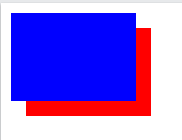

# HTML
### Các thẻ **`html`** thường dùng:
  - Thẻ `<html>`:
     - Như một thư mục gốc của một tài liệu HTML, có vai trò chứa tất cả các phần tử HTML khác trừ (`<!DOCTYOE>`).
     - Các trình duyệt hỗ trợ: Chrome, Firefox, IE, Safari, Opera.
     - Ex: 
        ```html
        <!DOCTYPE html>
        <html>
        <head>
            <title>Xin chào</title>
        </head>
        <body>
            Học lập trình 
        </body>
        </html>
        ```
  - Thẻ `<head>`:
    - Nằm giữa thẻ `<html>` và `<body>`, chứa những dữ liệu về tài liệu HTML, dùng để xác định tiêu đề, ký tự và các thông tin khác.
    - Ex:
        ```html
        <!DOCTYPE html>
        <html>
            <head>
                <meta charset="utf-8">
                <style> body {color:green;font-size:15px;}
                </style>
            </head>
            <body>
                Học lập trình
            </body>
        </html>
        ```

  - Thẻ `<title>`:
    - là thẻ chỉ ra tiêu đề của trang, Xuất hiện dưới dạng văn bản và được hiển thị ở thanh tiêu đề của trình duyệt hoặc tab của trang. Đây là một thẻ bắt buộc phải có trong mọi tài liệu của HTML.
    - Ex:
        ```html
        <!DOCTYPE html>
        <html>
            <head>
                <meta charset="utf-8">
                <title>Xin chào</title>
            </head>
        </html>
        ```
  - Thẻ `<body>`:
    - là thẻ xác định phần thân hay phần nội dung của tài liệu. Là vùng chứa cho tất cả các nội dung có thể nhìn thấy được như: tiêu đề, đoạn văn, hình ảnh, bảng biểu, danh mục,... Mỗi tài liệu HTML chỉ có duy nhất một thẻ `<body>`.
    - Ex:
        ```html
        <!DOCTYPE html>
        <html>
            <head>
                <title>Xin chào</title>
            </head>
            <body>
                <h1>Học lập trình tại đây</h1>
                <a href="https://facebook.com">
                    Link facebook
                </a>
                
            </body>
            </html>
            ```
  - Thẻ `<h1>`-`<h6>`:
    - Danh sách thẻ từ h1->h6 được sử dụng để chỉ rõ các tiêu đề trong tài liệu của HTML. Mức độ quan trọng của tiêu đề giảm dần từ h1 xuống h6. Mỗi trang chỉ dùng 1 thẻ `<h1>`.
    - Ex: 
        ```html
        <body>
            <h1>This is heading 1</h1>
            <h2>This is heading 2</h2>
            <h3>This is heading 3</h3>
            <h4>This is heading 4</h4>
            </body>
            ```
  - Thẻ `<div>`:
    - Định nghĩa một bộ phận hoặc một phần trong một tài liệu HTML. Được sử dụng để nhóm các phần tử để định dạng chúng bằng CSS.
    - Ex:
        ```html
        <body>
        <div style="font-size:18px; color:red">
        <p>Định nghĩa của div</p>
        <p>Tác dụng của thẻ div</p>
        </div>
        </body>
        ```
  - Thẻ `<p>`:
    - Định nghĩa một đoạn văn bản. Nó tự động tạo một khoảng trắng trước và sau nó, khoảng trắng này tùy trình duyệt sẽ khác nhau.
    - Ex:
        ```html
        <body>
        <p>This is a paragraph.</p>
        <p>This is another paragraph.</p>
        </body>
        ```
### DOCTYPE là:
  - `<!DOCTYPE>` là một đoạn định dạng không phải là thẻ html. Nó có tác dụng làm cho trình duyệt web biết được website đang được sử dụng phiên bản ngôn ngữ đánh dấu nào.
  - Khai báo `<!DOCTYPE>` phải là điều đầu tiên trong tài liệu html, trước tất cả các thẻ html.
  - Ex:
    ```html
    <!DOCTYPE html>
        <html>
            <head>
                <title>Tiêu đề</title>
            </head>
            <body>
                Sử dụng html 5
            </body>
        </html>
    ```
- Chạy một file html trên google chrome có rất nhiều cách. Một số cách đó:
  - Một là ta vào thư mục tìm đến file html sau đó chọn open with bằng trình duyệt chrome.
  - Hai là ta mở file html bằng công cụ Visual Studio Code, sau đó mở terminal rồi gõ câu lệnh "npm start".

# CSS
### Phân biệt các kiểu Position:
    | Kiểu     | Ý nghĩa                                                                                                                                                                                                             |
    | -------- | ------------------------------------------------------------------------------------------------------------------------------------------------------------------------------------------------------------------- |
    | static   | Dạng giá trị mặc định của position, sẽ hiển thị theo đúng thứ tự của nó một cách bình thường trên trang web (thường dùng để hủy các thuộc tính bên dưới).                                                           |
    | relative | Vị trí tuyệt đối (vị trí bao ngoài), giống như một nhân vật có khả nawg di chuyển nhưng luôn liên quan đến vị trí ban đầu, lúc này các thẻ html bên trong sẽ coi nó là thẻ cha.                                     |
    | absolute | Vị trí tuyệt đối cho thành phần theo thành phần bao ngoài hoặc theo cưa sổ trình duyệt. Nó xác định tọa độ của thành phần theo một thẻ cha relative (nếu có), nếu không có nó sẽ đi theo body của toàn trang web.   |
    | fixed    | Khi một web được kéo scroll browser thì menu hay button đứng yên một chỗ không thay đổi thì đó chính là position fixed. Giá trị này hoàn toàn phụ thuộc vào thằng cha, khi nào scroll trình duyệt thì nó hoạt động. |
### Thuộc tính `z-index:`
  - Được sinh ra để giải quyết cấp độ hiển thị của các thẻ HTML lên trình duyệt. `z-index` giống như đánh số thứ tự hiển thị, thẻ nào có `z-index` cao thì nằm phía trên.
  - Một số tính chất của `z-index`:
    - Chỉ thiết lập `z-index` được cho các thẻ có khai báo `position: absolute`.
    - Giá trị của nó là một con số(âm hoặc dương).
    - Hai thẻ có cùng `z-index` thì sẽ tuân theo thẻ nào nằm dưới thì sẽ được hiển thị phía trên, thẻ con sẽ nằm trên thẻ cha.
    - Giá trị `z-index` mặc định của các thẻ HTML là 1.
  - Cú pháp của `z-index` như sau:
    ```css
    selector{
        z-index: value
    }
    ```
    trong đó value là một trong giá trị sau:
    | Giá trị | Ví dụ           | Giải thích                                                    |
    | ------- | --------------- | ------------------------------------------------------------- |
    | auto    | z-index: auto   | Tự động sắp xếp chồng lên nhau theo thứ tự mặc định của HTML. |
    | một số  | z-index:111     | Sắp xếp chồng lên nhau theo giá trị truyền vào.               |
    | inherit | z-index:inherit | Thừa hưởng thuộc tính Z-index của thành phần cha.             |
  - Ex:
    ```html
    <body>
        <div class="map1"></div>
        <div class="map2"></div>
    </body>
    ```
    ```css
    .map1{
        width: 100px;
        height: 70px;
        background: red;
        top: 20px;
        left: 20px;
        position: absolute;
        z-index: 2;
    }
    .map2{
        width: 100px;
        height: 70px;
        background: blue;
        position: absolute;
        z-index: 3;
    }
    ```
    
### Specificity là:
- Là quy ước về độ ưu tiên của mỗi loại selector như: id, class, element,...
- Hệ thống phân cấp:
  - Inline styles: thiết lập thuộc tính CSS trực tiếp từ bên trong một phần tử.
  Độ ưu tiên inline styles là 1000.
    ```html
    <div style="color:red;">Học lập trình</div>
    ```
  - ID: thiết lập các thuộc tính CSS cho một phần tử được định danh duy nhất trong một trang như: #map1,menu,...
    Độ ưu tiên của id là 100.
    ```css
    #map {color: red;}
    ```
  - Classes, attributes and pseudo-classes: ví dụ class như .map, .menu,...attributes như a[target] và pseudo-classes] như là: :hover, :focus,...
  Độ ưu tiên của cấp bậc này là 10.
    ```css
    .menu {color: red;}
    a[class=menu] {color: blue;}
    .menu :hover {color:green;}
    ```
  - Element and pseudo-elements: ví dụ elements như `h1`,`h2`,`div`,... và pseudo-elements như là ::before, ::after, ::selection.
  Độ ưu tiên là 1.
    ```css
    h1 {color: red;}
    div {size: 25px;}
    div ::selection {color: green;}
    ```
- Nếu các selector có độ ưu tiên bằng nhau cùng thiết lập chung thuộc tính css cho một phần tử nào đó thì selector nào gần phần tử đó nhất sẽ được áp dụng.
    ```css
    div {color: red;}
    div {color: blue;}
    ```
    Ở màu ví dụ này màu nền của phần tử div sẽ là màu blue.
### Box model, box-sizing là:
- Box model dùng để mô tả khoảng cách mà mỗi phần tử trên website được sở hữu. Hay nó là kỹ thuật căn chỉnh khoảng cách hiển thị cho mỗi phần tử trên website. Box model được coi là kỹ thuật cơ bản nhất trong CSS Layout.
- Box-sizing là một thuộc tính quan trọng trong việc thiết kế giao diện cho trang web. Nó đơn giản hóa việc xác định và cài đặt kích thước của phần tử khi xây dựng bố cục trang web. Việc sử dụng thuộc tính box-sizing giúp ta tùy chỉnh width (height) để thiết lập chiều rộng, chiều cao của tất cả các phần tử trong đó bao gồm cả phần đường viền và phần đệm.
- Dưới đây là một số cấu trúc cú pháp đơn giản của box-sizing:
  ***box-sizing: value;***
  | value       | Ý nghĩa                                                                                                                             |
  | ----------- | ----------------------------------------------------------------------------------------------------------------------------------- |
  | content-box | Chiều rộng (chiều cao) được thiết lập từ thuộc tính width (height) nhưng chỉ đối với chiều rộng (chiều cao) của "nội dung" phần tử. |
  | border-box  | Chiều rộng (chiều cao) được thiết lập từ thuộc tính width (height) là chiều rộng (chiều cao) của cả phần tử.                        |
  | initial     | Chỉ sử dụng giá trị mặc định của nó. (trong trường hợp mặc định thì thuộc tính box-sizing) có giá trị là content-box.)              |
  | inherit     | Kế thừa giá trị thuộc tính box-sizing từ phần tử cha của nó.                                                                        |
  - Ex:
    ```html
    <body>
      <p>Phần tử 1</p>
      <div style="box-sizing: content-box"><hr><hr><hr></div>
      <p>Phần tử 2</p>
      <div style="box-sizing: border-box"><hr><hr><hr></div>
    </body>
    ```
    ```css
    <head>
    <style>
    div{
      boder: 3px solid black;
      padding: 30px;
      width: 300px;
      height: 150px;
    }
    </style>
    </body>
    ```
    - Với phần tử 1
      - chiều rộng = with + padding + border = 380px;
      - chiều cao =  height + padding + border = 230px;
    - Với phần tử 2:
      - Chiều cao = height = 150px
      - Chiều rộng = width = 150px
### media-query: 
- Là một trong những module mới được thêm vào trong CSS3. Nó là một sự cải thiện của Media Type đã có từ CSS2, bằng việc thêm vào những cú pháp query để ta có thể đáp ứng được cho nhiều device với nhiều kích cỡ màn hình khác nhau.
- Hiện tại máy tính không còn là phương tiện duy nhất giúp mọi người có thể truy cập vào website. Người ta có thể dùng điện thoại hoặc tablet...Và nó đã phát sinh ra những vấn đề mà những thiết bị kích cỡ màn hình quá nhỏ truy cập vào trang web. Một trong những cách giải quyết trước đây đã được sử dụng rộng rãi đó là thiết kế view riêng cho những thiết bị mobile và những view này được access qua một domain khác. Ngoài việc phải tạo ra script để xác nhận thiết bị truy cập thì cách giải quyết trên khiến ta phải luôn tạo ra 2 view khác nhau cho cùng một trang và mỗi khi cần thay đổi một nội dung gì đó thì ta cần phải thay đổi cả 2. Và media query ra đời để giải quyết được những vấn đề trên. Nó có thể giúp ta nhận biết được thiết bị truy cập thông qua những thuốc tính của nó. Giúp chũng ta áp dụng những  CSS rules khác nhau cho những thiết bị có kích cỡ màn hình khác nhau với những thiết bị khác nhau.
- Cú pháp của Media Query được mở rộng ra từ cú pháp của media type như sau:
    ```css
    @media media_type (feature:value) {rules}
    ```
  - Các thuộc tính `feature` và `value` sẽ giúp chúng ta xác định chính xác từng loại màn hình mà ta mong muốn.
  - Ngoài ra thì mặc định của Media Type sẽ luôn là `all`, thế nên ta có thể lược bỏ phần `media_type` ở trên nếu muốn nó được apply cho tất cả các devices.
  - Một số media feature quan trọng (Đọc thêm tại [media_query](https://hocjavascript.net/css/media-query-la-gi/)).
- Sử dụng media-query hiệu quả:
  Có 3 cách để sử dụng media query
  - Cách thứ nhất đó là sử dụng từ khóa `@media` để tính toán rules bên trong một stylesheet:
    ```css
    @media (expression) {body {font-size: 15px}}
    ```
  - Cách thứ hai đó là khai báo trong taglink với thuộc tính là media. Như vậy ra có thể gọi đến hẳn một stylesheet bên ngoài.
    ```html
    <link href="external files link" rel="stylesheet" media="all and (expression)">
    ```
  - Cách thứ 3 đó là sử dụng từ khóa `@import` để load một external stylesheet bên trong một external stylesheet.
    ```css
    @import url('file') all and (expression);
    ```
- Cách hoạt động:
  - Media Query sử dụng `@media` để áp dụng một khối thuộc tính css chỉ khi thỏa mãn một điều kiện nào đó.
  Ex:
    ```css
    @media only screen and (max-width: 500px) {
      body {
        background-color: lightblue;
      }
    }
    ```
  Ở ví dụ trên, thuộc tính `background-color` chỉ được áp dụng cho thẻ body trong trường hợp độ rộng của màn hình nhỏ hơn 500px.
  - Thêm các breakpoint- là các điểm mà chúng ta sử dụng để kích hoạt việc thay đổi bố cục của trang web. Ví dụ dưới đây ta sẽ sử dụng một breakpoint là 768px (tablet). Nếu độ rộng của trình duyệt nhỏ hơn hoặc bằng 768px thì tất cả các cột đều chiếm độ rộng 100%. Ex:
    ```css
    /*for desktop: */
    .col-1 {width: 8.33%;}
    .col-2 {width: 16.66%;}
    .col-3 {width: 25%;}
    .col-4 {width: 33.33%;}
    .col-5 {width: 41.66%;}
    .col-6 {width: 50%;}
    .col-7 {width: 58.33%;}
    .col-8 {width: 66.66%;}
    .col-9 {width: 75%;}
    .col-10 {width: 83.33%;}
    .col-11 {width: 91.66%;}
    .col-12 {width: 100%;}
    @media only screen and (max-width: 768px) {
      /*for mobile phones: */
      [class*="col-"] {
        width: 100%;
      }
    }
    ```
    [Run](http://demo.codegym.vn/web/15/mediaqueries/responsive.html)
  - Nên ưu tiên thiết kế cho thiết bị di động trước tiên (Mobile First). Chúng ta ưu tiên cho các thiết bị di động trước, sau đó mới thêm mã CSS để trang web hiển thị tốt trên các thiết bị to hơn. Điều này sẽ giúp cho việc hiển thị các trang web ở trên thiết bị di động được nhanh hơn. Để làm được điều này, chúng ta thay đổi một chút trật tự của các khối CSS. Trong đó, thay vì sử dụng điều kiện `max-width` thì sử dụng `min-width`
    ```css
    /* For mobile phones: */
    [class*="col-"] {
      width: 100%;
    }
    @media only screen and (min-width: 600px) {
      /* For tablet: */
    .col-m-1 {width: 8.33%;}
    .col-m-2 {width: 16.66%;}
    .col-m-3 {width: 25%;}
    .col-m-4 {width: 33.33%;}
    .col-m-5 {width: 41.66%;}
    .col-m-6 {width: 50%;}
    .col-m-7 {width: 58.33%;}
    .col-m-8 {width: 66.66%;}
    .col-m-9 {width: 75%;}
    .col-m-10 {width: 83.33%;}
    .col-m-11 {width: 91.66%;}
    .col-m-12 {width: 100%;}
    }
    @media only screen and (min-width: 768px) {
      /* For desktop: */
    .col-1 {width: 8.33%;}
    .col-2 {width: 16.66%;}
    .col-3 {width: 25%;}
    .col-4 {width: 33.33%;}
    .col-5 {width: 41.66%;}
    .col-6 {width: 50%;}
    .col-7 {width: 58.33%;}
    .col-8 {width: 66.66%;}
    .col-9 {width: 75%;}
    .col-10 {width: 83.33%;}
    .col-11 {width: 91.66%;}
    .col-12 {width: 100%;}
    }
    ```
    [Run](http://demo.codegym.vn/web/15/mediaqueries/.responsive-3-breakpoints.html)
### Phân biệt display:
- ***Inline***: là cách hiển thị trên một hàng và chiều rộng của thẻ đó sẽ phụ thuộc vào nội dung bên trong của thẻ. Vì vậy nhiều thẻ có thể nằm trên cũng một hàng và một số thuộc tính CSS không sử dụng được như thuộc tính `margin-top`,`margin-bottom`. Các thẻ được hiển thị mặc định **inline**là: `span`,`a`,`strong`,`b`,`i`,...
- ***Block***: là cách hiển thị chiếm một khoảng rộng (một khối) và có chiều rộng bằng 100%. Vì vậy khi bạn dùng thẻ này thì mặc dù nội dung ngắn nhưng các thẻ khác ở phía dưới vẫn nằm ở vị trí bên dưới nó. Các thẻ html mặc định ***block*** là: `div`, `p`,`h1`->`h6`,`header`,`footer`,...
- ***inline-block***: là cách hiển thị kết hợp cả hai cách trên, nghĩa là có thể sử dụng CSS để chia khối và nằm cùng trên cùng một hàng. Thuộc tính này thường được sử dụng khi bạn muốn một thẻ hiển thị dạng khối và có thể nằm trên cùng một hàng.
### !important:
- Trong CSS **`!important`** được sử dụng để thể hiện mức độ quan trọng của Property/value hơn mức bình thường.
- Nếu ta sử dụng **`!important`** nó sẽ ghi đè tất cả các quy tắc tạo kiểu trước đó của thuộc tính cụ thể trên phần tử.
  Ex:
  ```html
  <p id="green">Hello</p>
  ```
  ```css
  p {
    color: yellow !important;
  }
  #green {
    color: green;
  }
  ``` 
  Dù cho id có độ ưu tiên cao hơn thẻ `p` nhưng thẻ `p` đã sử dụng `!important` nên nó sẽ hiển thị màu vàng.
- Để sử dụng `!important` hiệu quả ta sẽ dùng chúng đối với các utility classes. Cách duy nhất để ghi đè `!important` là sử dụng thêm `!important` khác và nó sẽ phải khai báo sau cái bạn muốn ghi đè trong Css.
### Các đơn vị px, em, rem:
- Đơn vị được chia thành 2 nhóm: 
  - Đơn vị tuyệt đối (absolute units)-là đơn vị vật lý được định nghĩa sẵn, không thể thay đổi hay phụ thuộc phần tử nào. Đơn vị tuyệt đối trong CSS có:
    - ***px***: Đây là đơn vị thường thấy được sử dụng trên màn hình hiển thị, 1px tương đương với một điểm ảnh trên màn hình hiển thị
  -  Đơn vị tương đối (relative units): là các đơn vị đo lường được sử dụng trong CSS ở mức tương đối, nó sẽ được thay đổi bởi các thành phần khác. Một số trong đơn vị tương đối là:
     -  ***em***: là đơn vị tương đối dựa vào thuộc tính font-size của phần tử mẹ. Ví dụ: nếu phần tử mẹ có thuộc tính font-size: 16px, phần tử con có thuộc tính font-size: 2em thì có nghĩa phần tử con có font-size: 32px.
     -  ***rem***: là đơn vị tương đối dựa vào thuộc tính font-size của phần tử html. Ví dụ nếu phần tử html có thuộc tính font-size: 12px phần tử mẹ có thuộc tính font-size: 16px, phần tử con có thuộc tính font-size: 2rem thì có nghĩa là phần tử con có thuộc tính font-size: 24px. Tức là đơn vị rem không phụ thuộc vào phần tử mẹ.
### Overflow:
- Khi nội dung của một phần tử nào đó quá lớn so với kích cỡ của phần tử thì nội dung đó sẽ tràn ra khỏi khu vực được chỉ định cho phần tử đó. Thuộc tính `overflow` cho phép mình khắc phục khó khăn trên bằng cách cắt đi phần nội dung bị tràn hoặc thêm thanh cuộn cho phần tử đó.
- 4 giá trị chính của thuộc tính `overflow`:
  - ***visible***: phần nội dung bị tràn không bị cắt đi mà chúng sẽ ghi đè lên các phần tử khác.
  Ex:
      ```css
      div.overflow{
        background-color: gray;
        width: 300px;
        height: 50px;
        border: 1px solid black;
        overflow: visible;
      }
      ```
      [Run](https://freetuts.net/editor_display.html?id=1447)
  - ***hidden***: phần nội dung bị tràn ra bị cắt đi và phần nội dung đó sẽ bị ẩn đi.
      ```css
      div.overflow {
        background-color: gray;
        width: 300px;
        height: 50px;
        border: 1px solid black;
        overflow: hidden;
      }
      ```
      [Run](https://freetuts.net/editor_display.html?id=1448)
  - ***scroll***: phần nội dung bị tràn ra vẫn bị cắt đi, tuy nhiên trình duyệt sẽ có thêm thanh scroll, mình có thể kéo xem phần nội dung bị ẩn đi. Thanh scroll này được thêm vào cho cả chiều dọc và chiều ngang của phần tử.
  Ex:
    ```css
    div.overflow {
      background-color: gray;
      width: 300px;
      height: 50px;
      border: 1px solid black;
      overflow: scroll;
    } 
    ```
    [run](https://freetuts.net/editor_display.html?id=1449)
  - ***auto***: cũng giống như giá trị `scroll`, tuy nhiên thanh scroll sẽ đc thêm vào khi cần thiết.
    ```css
    div.overflow {
      background-color: gray;
      width: 300px;
      height: 50px;
      border: 1px solid black;
    }
    ```
    [run](https://freetuts.net/editor_display.html?id=1450)
### CSS preprocessors:
- Là một ngôn ngữ kịch bản mở rộng của CSS và được biên dịch thành cú pháp CSS giúp bạn viết CSS nhanh hơn và có cấu trúc rõ ràng hơn. Nó có nhiệm vụ giúp ta logic hóa và cấu trúc các đoạn mã CSS để cho CSS tiến đến gần hơn với một ngôn ngữ lập trình.
- Hiểu đơn giản nó cho phép developer viết mã từ một ngôn ngữ nào đó, ngôn ngữ đó ở đây chính là SASS/SCSS, LESS hay một ngôn ngữ tương tự, sau đó biên dịch nó thành CSS.
- Một vài quy tắc của CSS preprocessors:
  - *Quy tắc xếp chồng*:
    Ex:
    ```sass
    /*SASS*/
    header{
      margin-bottom: 20px;
      nav{
        height: 30px;
      }
      a{
        color: white;
      }
    }
    ```
    Sau khi biên dịch ta thu được code CSS như sau:
    ```css
    /*CSS*/
    header{
      margin-bottom: 20px;
    }
    header nav{
      height: 30px;
    }
    header a{
      color: white;
    }
    ```
    Với cách viết này ta dễ dàng tổ chức lại các dòng CSS theo hệ thống phân cấp HTML. Điều này giúp ta thuận tiện trong việc định dạng và bảo trì style hơn.
  - *Biến*:
    - Được dùng để lưu trữ những giá trị mà bạn đã xác định là sẽ sử dụng nhiều lần trong suốt quá trình style của mình như các mã màu, font chữ, giá trị border, shadows hay bất kì giá trị nào mà bạn muốn. Với SASS kí hiệu $ được sử dụng để định nghĩa biến.
      Ex:
      ```sass
      $blue-color: blue;
      $padding: 20px;

      nav {
        padding: $padding;
      }
      .sidebar a {
        color: $blue-color;
      }
      ```
    - *Quy tắc mixin:*
      - được hiểu tương tự như một function trong các ngôn ngữ lập trình khác, cái mà bạn có thể truyền giá trị vào, xử lý và trả ra kết quả. Chúng được định nghĩa nhằm mục đích dễ dàng gọi ra và sử dụng nhiều lần trong website chỉ bằng một cú pháp đơn giản.
        Ex:
        ```sass
        /*SASS*/
        =border-radius($radius) {
        -webkit-border-radius: $radius
        -moz-border-radius: $radius
        -ms-border-radius: $radius
        border-radius: $radius
        }
        .box{
          +border-radius(10px)
        }
        ```
        ```css
        /* CSS nhận được sau khi compile */
        .box{
          -webkit-border-radius: 10px;
          -moz-border-radius: 10px;
          -ms-border-radius: 10px;
          border-radius: 10px;
        }
        ```
  - Sự lợi hại của CSS preprocessors:
    - Tiết kiệm thời gian viết code.
    - Dễ dàng bảo trì và phát triển CSS.
    - Các tập tin CSS được tổ chức một cách rõ ràng.
=> [Bài viết tham khảo.](https://viblo.asia/p/css-preprocessors-va-nhung-dieu-can-biet-phan-1-RnB5pybJKPG)
### Các cách căn giữa một thẻ `div`:
- Sử dụng position và transform:
  Ex:
  ```html
  /*HTML*/
  <body>
    <div class="parent">
      <div class="child"></div>
    </div>
  </body>
  ```
  ```css
  /*CSS*/
  .parent{
    background-color: green;
    width: 100vw;
    height: 100vh;
    position: relative;
  }
  .child{
    background-color: yellow;
    width: 150px;
    height: 150px;
    position: absolute;
    top: 50%;
    left: 50%;
    transform: translate(-50%,-50%);
  }
  ```
  Sau khi chạy ta được
  
- Sử dụng `flexbox`:
  - `justify-content` và `align-items`:
    Ex:
    ```css
    /*CSS*/
    .parent{
      background-color: green;
      width: 100vw;
      height: 100vh;
      display:flex;
      justify-content: center;
      align-items: center;
    }
    .child{
      background-color: yellow;
      width: 150px;
      height: 150px;
    }
    ```
  - Ta dùng `margin: auto`:
    Ex:
    ```css
    /*CSS*/
    .parent{
      background-color: yellow;
      width: 100vw;
      height: 100vh;
      display:flex;
    }
    .child{
      background-color: green;
      width: 150px;
      height: 150px;
      margin: auto;
    }
    ```
    Cả 2 cách trên ta đều chạy được:
    

# JS:
### Cookies, sessionStorage và localStorage:
- ***Cookies***: là dữ liệu, được lưu trữ trong những file văn bản nhỏ, trên máy tính của bạn.
  - Khi một máy chủ web đã gửi một trang web tới một trình duyệt, kết nối sẽ bị ngắt và nó sẽ quên mọi thứ về người dùng.
  - Cookies được phát minh để giải quyết cho vấn đề "cách ghi nhớ mọi thông tin của người dùng":
    - Khi một người dùng truy cập vào một trang web, tên người đó có thể được lưu trữ trong một cookie.
    - Lần tới khi người dùng truy cập trang cookie sẽ ghi nhớ tên của họ.
    Ex:
    ```js
    username ="John Doe";
    ```
  - Khi một trình duyệt yêu cầu một trang web từ một máy chủ, các cookies của trang được thêm vào yêu cầu. Bằng cách này máy chủ sẽ nhận được dữ liệu cần thiết để ghi nhớ thông tin về người dùng.
  - Có thể tạo, đọc và xóa cookies với thuộc tính`document.cookie`:
    ```js
    /* Create nameUser*/
    document.cookie = "username="Phan Hào";
    /*thêm ngày tồn tại của cookie vì mặc định cookie sẽ xóa khi trình duyệt đóng*/
    document.cookie = "username="Phan Hào; expires=Thu, 18 Dec 2024 12:00:00 UTC";
    /* tham số đường dẫn cho trình duyệt biết cookie thuộc về đường dẫn nào, mặc định cookie thuộc về trang hiện tại*/
    document.cookie = "username="Phan Hào; expires=Thu, 18 Dec 2024 12:00:00 UTC; path=/";
    ```
- Local Storage là một module của JS, hoạt động trên các trình duyệt web như chrome/Firefox. Nó dùng để lưu trữ dữ liệu tạm thời và riêng biệt cho từng domain, nên đây được xem là giải pháp để thay thế cho cookie.
- Chúng ta có hai loại local storage trong JS đó là:
  - ***localStorage***: lưu trữ dữ liệu vô thời hạn, dữ liệu sẽ được lưu trữ cho tới khi người dùng clear history.
  - ***sessionStorage***: lưu trữ dữ liệu cho một phiên làm việc, có nghĩa dữ liệu sẽ bị mất khi bạn tắt browser.
- ***localStorage***: lữu trữ dữ liệu vô thời hạn, có nghĩa là dữ liệu sẽ không bị mất cho tới khi bạn sử dụng tính năng clear history của trình duyệt, hoặc bạn sử dụng chính localStorage API để xóa.
  - Chúng ta có hai thao tác chính là gán dữ liệu và lấy dữ liệu. Và trước khi sử dụng dụng các phương thức này thì ta phải chắc chắn là trình duyệt chắc chắn có hỗ trợ nhé, bởi local store chỉ hoạt động dựa trên các trình duyệt mới nhất hiện nay (tính từ ES6 2015). Đoạn code dưới đây sẽ giúp ta kiểm tra trình duyệt có hỗ trợ localStorge hay là không.
    ```js
    if(typeof(Storage) !== "undefined") {
      //có hỗ trợ local storage
    } else {
      //không hỗ trợ local storage
    }
    ```
  - localstorage được tích hợp sẵn vào **window interface**, nên để sử dụng thì bạn chỉ việc gọi đến `window.localStorage`. Tuy nhiên, vẫn có một biến cục bộ localStorage nên bạn có thể bỏ **window interface** khi sử dụng.
  - localStorage có 5 phương thức:
    - setItem(): Thêm dữ liệu vào localStorage;
    - getItem(): Lấy dữ liệu từ localStorage;
    - removeItem(): Xóa dữ liệu ra khỏi localStorage;
    - clear(): Xóa toàn bộ dữ liệu ra khỏi localStorage;
    - key(): Lấy tên key của dữ liệu đang lưu trữ trong localStorage;
- ***sessionStorage***: cũng tương tự như localStorage, chỉ có một điểm khác đó là dữ liệu của sessionStorage sẽ mất khi bạn đóng trình duyệt, còn localStorage thì không.
  - Ngoài ra, sessionStorage sẽ lưu trữ khác nhau cho mỗi tab. Nghĩa là khi bạn lưu dữ liệu ở tab này, xong bạn mở tab khác lên thì sẽ không thể sử dụng được dữ liệu đó.
  - sessionStorage không tồn tại hai phương thức getItem và setItem mà bạn sẽ bổ sung key và value cho nó.
  - sessionStorage cũng có 5 phương thức: 
    - setItem(): Thêm dữ liệu vào sessionStorage;
    - getItem(): Lấy dữ liệu từ sessionStorage;
    - removeItem(): Xóa dữ liệu ra khỏi sessionStorage;
    - clear(): Xóa toàn bộ dữ liệu ra khỏi sessionStorage;
    - key(): Lấy tên key của dữ liệu đang lưu trữ trong sessionStorage;
- So sánh:
  | Cookie                                                                                                                                                                                                                                                                                                                                                                                                                                                                      | localStorage và sessionStorage                                                                                                                                                                                                                                                                                                                                                                                                                                                                          |
  | --------------------------------------------------------------------------------------------------------------------------------------------------------------------------------------------------------------------------------------------------------------------------------------------------------------------------------------------------------------------------------------------------------------------------------------------------------------------------- | ------------------------------------------------------------------------------------------------------------------------------------------------------------------------------------------------------------------------------------------------------------------------------------------------------------------------------------------------------------------------------------------------------------------------------------------------------------------------------------------------------- |
  | Dữ liệu của cookie được lưu trữ riêng biệt theo từng domain, và dung lượng lưu trữ không được nhiều.Khi một trang web tải lên thì sẽ có rất nhiều request được gửi tới server có thể đó là những request yêu cầu tải hình ảnh, file css, file js...nói chung là rất nhiều.Theo cơ chế của cookie thì bất kì một request nào gửi lên server đều gửi kèm dữ liệu cookie của domain đó. Vì vậy với số lượng hàng trăm request đó thì có thể sẽ ảnh hưởng đến tốc độ tải trang. | Dữ liệu sẽ lưu trữ ở trình duyệt cuae khách mà thôi. Nó sẽ không được gửi kèm trong các request, điều này giúp giảm tải lượng dữ liệu mỗi khi load dữ liệu từ server. Ngoài ra, dung lượng lưu trữ của local storage nhiều hơn so với cookie. Cookie:4kb; localStorage: 5mb; sessionStorage: 10mb. Nếu mà muốn sử dụng dữ liệu dạng object vào localStorage thì hãy sử dụng kết hợp với phương thức JSON.stringify. Tức là ra sẽ chuyển đối tượng đó thành một chuỗi JSON rồi lưu trữ vào localStorage. |
### Các kiểu dữ liệu trong JS:
- là cách phân loại dữ liệu để trình biên dịch hoặc trình thông dịch hiểu người lập trình muốn sử dụng loại dữ liệu nào.
- Trong JS chỉ có 6 kiểu dữ liệu cơ bản:
  - ***Strings***: (chuỗi văn bản) là một chuỗi các kí tự như `"Phan Hào"`
    - Strings được viết trong dấu ngoặc kép. Ta có thể sử dụng dấu ngoặc đơn hoặc ngoặc kép.
      Ex:
      ```js
      let firstName="Phan Hào";
      let fullName="Phan Thanh Hào";
      ```
    - Ta có thể sự dụng dấu ngoặc kép (hoặc ngoặc đơn) bên trong một chuỗi,  miễn là nó không ảnh hưởng các trích dẫn xung quanh chuỗi.
      ```js
      let answer1="It's alright";
      let answer2='He is called "Phan Hào"';
      ```
  - ***Numbers***: tất cả số trong JS đều được lưu trữ dưới dạng số thập phân (float).
    - Khi khai báo số có thể được viết có hoặc không ở dạng số thập phân.
      ```js
      let x = 43.00;
      let y = 34;
      ```
    - Số cực lớn hoặc số cực nhỏ có thể được viết với kí tự khoa học (số mũ):
      ```js
      let x = 123e5; // 12300000
      let y = 123e-5; //0.00123
      ```
    - Lưu ý: Trong mọi ngôn ngữ lập trình luôn có các kiểu số sau:
      - Số nguyên (integers): byte (8-bit), short (16-bit), int(32-bit), long(64-bit).
      - Số thực (floating): float(32-bit), double(64-bit).
  - ***JS BigInt***:
    - Tất cả số trong JS đều được lưu trữ ở dạng số thực(float) 64-bit.
    - JS BigInt là một kiểu dữ liệu mới(2020) nó có thể được sử dụng để lưu trữ giá trị số nguyên quá lớn để được hiển thị bằng số JS bình thường.
      ```js
      let x = BigInt("123456789012345678901234567890");
      ```
  - ***JS Booleans***: chỉ có hai giá trị là `true` hoặc `false`.
    ```js
    let x = 10;
    let y = 3;
    let z = 3;
    (x==y); //returns true
    (y==z); // return false
    ```
  - ***JS Arrays***:
    - Được viết được viêt bằng dấu ngoặc vuông.
    - Các phần tử được phân tách bằng dấu phẩy.
    - Đoạn mã dưới đây được khai báo với tên là `cars`, nó chứ 3 phần tử :
      ```js
      const cars =["Lexus","Volvo","BMW"];
      ```
    - Các chỉ mục mảng dựa trên số không, nghĩa là item đầu tiên là [0], item thứ hai là [1], và tăng dần
  - ***JS Objects***:
    - Được viết bằng dấu ngoặc nhọn.
    - Thuộc tính Object được viết dưới dạng name:giá trị, ngăn cách bởi dấu phẩy.
      Ex:
      ```js
      const person ={firstName: "Hào", lastname:"Phan Thanh", age: 23; eyecolor: "green"};
      ```
### `"Hoisting"`:
- Khi thực thi một đoạn mã JS thì trình biên dịch sẽ tạo ra một bối cảnh thực thi chung, ta gọi là **global execution context**.
- Bối cảnh thực thi này sẽ có 2 giai đoạn, thứ nhất là tạo và thứ hai là thực thi.
- Trong giai đoạn tạo thì JS sẽ di chuyển các khai báo biến lên đầu của đoạn mã, giúp cho chương trình ko bị lỗi khi sử dụng biến trước khi khai báo. Tính năng này ta gọi là tính năng lưu trữ trong JS và trong tiếng anh foij là Hoisting.
- Trong Js bạn có thể định nghĩa một biến sau khi sử dụng nhờ tính năng `hoisting`. JS sẽ di chuyển toàn bộ khai báo biến lên đầu chương trình. Vì vậy, những dòng code có sử dụng biến mà chưa khai báo sẽ ko bị lỗi.
  ```js
  domain = 'freetust.net';
  document.write("Domain là: "+ domain);
  var domain;
  document.write("</br/> Domain là: "+domain);
  // Kết quả: Domain là freetuts.net
  ```
  Đoạn code trên cũng giống vs:
  ```js
  var domain;
  domain = "freetust.net";
  document.write("Domain là: "+ domain);
  document.write("<br/> Domain là: " + domain);
  ```
- Sử dụng `let` và `var` trong `hoisting`:
  - Sử dụng `var`: nếu chưa gắn giá trị thì sẽ trả về undefined.
    Ex:
    ```js 
    console.log(domain); //undefined
    var domain = 3;
    ```
    Đoạn mã trên tương đương với đoạn mã sau:
      Ex: 
      ```js
      var domain;
      console.log(domain); //undefined
      domain = 3;
      ```
  - Sử dụng `let`: nếu chưa gán giá trị thì sẽ xuất hiện thông báo lỗi `Cannot access before initialization`.
    Ex:
    ```js
    console.log(domain);
    let codomainunter =1;
    // Kết quả:
    "ReferenceError: Cannot access 'domain' before initialization"
    ```
    Lỗi này muốn nói rằng biến `domain` đã được định nghĩa trong bộ nhớ ***heap*** nhưng chưa được khởi tạo.
- Hàm `hoisting` trong js: cũng giống như các biến, công cụ js cũng lưu trữ các khai báo hàm. Nó sẽ di chuyển các khai báo hàm lên đầu của chương trình.
  Ex:
  ```js 
  let x = 20, y =10;
  let result = add(x,y);
  cosole.log(result);
  function add(a,b) {
    return a+b;
  }
  ```
  Đoạn code trên tương tự như:
  ```js
  function add(a,b){
    return a +b;
  }
  let x = 20, y = 10;
  let result = add(x,y);
  cosole.log(result);
  ```
- `Hoisting` trong biểu thức hàm:Biểu thức hàm hay còn gọi là ***function expressions***. Nó là một hàm được khai báo bằng cách gán vào một biến.
  Ex: 
  ```js
  var add = function(x,y) {
    return x +y;
  }
  ```
  Hàm `add` chính là một `function expressions`.
  Ex:
  ```js
  let x = 20, y = 10;
  let result = add(x,y)
  console.log(result);
  var add = function(x,y){
    return x +y;
  }
  /* Kết quả:
  "TypeError: add is not a function"
  */
  ```
  Ở ví dụ trên js sẽ xem `add` là một biến thông thường, khi đưa lên đầu thì sẽ là một biến chứ ko phải là một hàm. Vì vậy, khi sử dụng sẽ xuất hiện lỗi ***add is not function***.
- `Hoisting` trong arrow function:
  - Cú pháp `arrow function` sẽ như sau:
    Ex:
    ```js
    var function_name = () => bieuthuc;
    ```
    Chính vì vậy nếu bạn sử dụng `arrow function` trước rồi mới khai báo thì sẽ bị lỗi `function_name` không phải là một hàm.
### `==` và `===`:
  | `==`                                                                                                                                                          | `===`                                                                                                     |
  | ------------------------------------------------------------------------------------------------------------------------------------------------------------- | --------------------------------------------------------------------------------------------------------- |
  | - Được gọi là toán tử so sánh trừu tượng.                                                                                                                     | - Được gọi là toán tử so sánh cân bằng nghiêm ngặt.                                                       |
  | - Toán tử so sánh trừu tượng sẽ cố gắng giải quyết các kiểu dữ liệu thông qua việc chuyển đổi kiểu dữ liệu trước khi so sánh.Ex: `console.log(3=="3") //true` | Toán tử so sánh nghiêm ngặt sẽ trả về false nếu các giá trị khác nhau. Ex: `console.log(3==="3") //false` |
  | - Nhìn vào ví dụ trên thì toán tử `==` trả về true thì chuỗi `"3"` được chuyển thành số 3 trước khi việc so sánh được thực hiện.                              | - Trong khi `===` cho thấy rằng đây là 2 kiểu dữ liệu khác nhau nên trả về false.                         |
- Tuy nhiên, trong thực tế có 1 vài trường hợp mà hành vi của các toán tử này không trực quan. Chúng ta có vài ví dụ:
  Ex: 
  ```js 
  console.log(undefined == null); //true
  console.log(undefined === null);//false. Undefined and null là hai kiểu riêng biệt và không thể thay thế hoán đổi cho nhau.
  ```
  ```js
  console.log(true == 'true'); //false
  console.log(true === 'true'); //false
  // All: String là một chuỗi không thể chuyển đổi thành boolean và ngược lại.
  ```
-  Ví dụ minh họa so sánh một chuỗi bình thường với các đối tượng chuỗi(String Object):
  ```js
  console.log("This is a string." == new String("This is a string.")); //true
  console.log("This is a string." === new String("This is a string.")); //false
  // Bởi vì
  console.log(typeof "This is a string."); //string
  console.log(typeof new String("This is a string.")); //Object
  ```
- Với các toán hạng tham chiếu khi so sánh kiểu bắc cầu thì cả so sánh trừu tượng và so sánh nghiêm ngặt sẽ trả về false, trừ khi cả 2 toán hạng đề cập đến cùng 1 đối tượng chính xác, để làm rõ hơn chúng ta xem ví dụ sau:
  Ex:
  ```js
  var a = [];
  var b = [];
  var c = a;
  console.log(a == b); //false  
  console.log(a === b); //false
  console.log(a == c);  //true
  console.log(a === c); //true
  ```
  Mặc dù a và b cùng loại giá trị như nhau nhưng kết quả trả về của cả 2 kiểu so sánh đều là false.
### `This` trong JS:
- Trong js, `this` là từ khóa đề cập đến đối tượng.
- Từ khóa `this` đề cập đến các đối tượng khác nhau phụ thuộc vào cách nó được sử dụng:
  - Trong một phương thức đối tượng, `this` đề cập đến đối tượng.
  - Khi một mình, `this` đề cập đến đối tượng chung.
  - Trong một function,`this` đề cập tới đối tượng tổng quát.
  - Trong một function, ở chế độ nghiêm ngặt, `this` là undefined.
  - Trong một sự kiện, `this` đề cập tới các ***element*** được nhận sự được đó.
  - Các phương thức như `call()`, `apply()`, and `bind()` có đề cập `this` có mọi đối tượng.
  - ***Note***: `this` không phải là một biến. Nó là một từ khóa. Ta không thể thay đổi giá trị của `this`.
- `this` trong một Method:
  - Khi được sử dụng trong một phương thức object, `this` đề cập đến đối tượng.
  - Trong ví dụ sau, `this` đề cập đến đối tượng `person`:
    Ex:
    ```js
    <script>
      const person = {
        firstName: "Hào",
        lastName: "Phan Thanh",
        age: 23,
        fullName: function() {
          return this.lastName +" "+this.firstName;
        }
      }
    </script>
    // kết quả: fullName: Phan Thanh Hào
    ```
- Khi được sử dụng một mình, `this` đề cập đến đối tượng tổng quát. Bởi vì `this` đang chạy trong phạm vi tổng quát. Trong trình duyệt *window* đối tượng tổng quát là `[object Window]`:
  Ex:
  ```js
  <script>
    let x = this;
    document.innerHTML = x;
    // Ở đây cho kết quả [object Window]
  </script>
  ```
- Trong phạm vi nghiêm ngặt, khi được sử dụng một mình, `this` cũng đề cập đến đối tượng tổng quát.
  Ex:
  ```js
    <script>
      "use strict";
      let x = this;
      document.innerHTML = x;
      // Kết quả ở đây là: [object Window]
    </script>
  ```
- `this` trong Function (Default)
  - Trong một function, **global object** là ràng buộc mặc định cho `this`.
  - Trong một trình duyệt Window, **global object** là `[object Window]`:
- `this` trong một Function (Strict)
  - js ở chế độ nghiêm ngặt (use strict) không cho phép ràng buộc mặc định.
  - Nhưng khi được sử dụng ở một function, trong chế độ nghiêm ngặt, `this` là `undefined`.
    Ex:
    ```js
    <script>
      function myFunction(){
        return this;
      }
      // Kết quả: undefined
    </script>
    ```
- `this` trong `event`:
  - Trong trình xử lý sự kiện HTML, `this` đề cập đến các element HTML đã nhận sự kiện đó:
  Ex:
    ```html
    <button onclick="this.style.color='red'">Click me</button>
    ```
### Arrow function:
- ***Function***: hay còn gọi là Regular Function, lav việc khai báo hàm thông thường. Hàm thông thường là những hàm bạn chỉ cần khai báo 1 lần và có thể sử dụng ở nhiều nơi khác.
- ***Arrow function***: Hay còn gọi là hàm mũi tên. Arrow function là tính năng mới xuất hiện trong phiên bản ES6. Sử dụng hàm này sẽ giúp code ngắn gọn và súc tích hơn.
- Tuy cả 2 đều là function nhưng Arrow Function và Regular Function có sự khác biệt nhất định cụ thể như sau:
  - Cú pháp thành lập:
    - Arrow Function sử dụng ký tự `=>` trong cú pháp. Ex:
        ```js
        hello = ()=>{
          console.log('hello')
        }
        ```
    - Regular Function có cú pháp sau:
        ```js
        function hello(){console.log('hello')}
        ```
    - Từ hai ví dụ trên ta thấy cú pháp của arrow function thường ngắn gọn hơn so với Regular Function. Ngoài ra, sự khác biệt trong cú pháp giữa hai hàm này nằm ở từ khóa return.
    - Với arrow function, ta có thể bỏ qua từ khóa này:
        ```js
        double = a => a*2
        ```
    - Còn với Regular Function thì không. Ví dụ:
        ```js
        function double(a){
          return a*2
        }
        ```
  - Giá trị từ khóa `this`:
    - Đối với Regular Function, giá trị của `this` thay đổi theo ngữ cảnh. Nó có thể là global object hoặc undefeined. VD:
      ```js
      const myObject={
        method(){
          console.log(this);
        }
      }
      myObject.method();
      //=> "myObject"
      ```
    - Với Arrow Function, giá trị của `this` sẽ bằng giá trị của function ở ngoài.VD:
      ```js
      const myObject={
        myMethod(items){
          console.log(this);//"myObject"
          const callback =() =>{
            console.log(this);//"myObject"
          };
          items.forEach(callback);
        }
      };
      myObject.myMethod([1,2,3]);
      ```
- Khi nào nên sử dụng Regular Function và Arrow Function:
  - Với Arrow Function, bạn nên sử dụng nó khi làm việc với callbacks function như map, filter, reducer,..
  - Regular Function lại phát huy hiệu quả tốt hơn khi làm việc với object. Hai hàm này không thể thay thế nhau mà hãy sử dụng chúng hợp lý để phát huy hiệu quả cao nhất.
### `Func.bind` và `Func.apply` có tác dụng:
- ***Function bind()***:
  - Với phương thức `bind()`, một đối tượng có thể mượn một phương thức từ một đối tượng khác.
    Ex:
    ```js
    const person = {
      firstName: "Hào",
      lastName: "Phan Thanh",
      fullName: function (){
        return this.lastName + " " + this.firstName;
      }
    }

    const member = {
      firstName: "Nam",
      lastName: "Nguyễn Văn",
    }
    let fullName = person.fullName.bind(member);
    // return: Nguyễn văn Nam
    ```
  - Thi thoảng phương thức `bind()` được sử dụng để ngăn chặn mất `this`.
  - Khi một function được sử dụng gọi một callback, `this` biến mất.
  - Trong ví dụ này sẽ nó sẽ cố gắng hiển thị tên của display sau 3 giây, nhưng thay vì đó nó sẽ hiển thị undefined.
    ```js
    const person = {
      firstName: "Hào",
      lastName: "Phan Thanh",
      display: function(){
        let x = document.getElementById("demo");
        x.innerHTML = this.lastName +" "+this.firstName;
      }
    }
    setTimeout(person.display, 3000);
    //Return: Undefined Undefined
    ```
  - Thuộc tính `bind()` sẽ giải quyết vấn đề này.
  - Trong ví dụ sau, thuộc tính `bind()` sẽ được sử dụng để bind person.display đến person. Nó sẽ hiển thị tên người dùng sau 3 giây:
    ```js
      const person = {
      firstName: "Hào",
      lastName: "Phan Thanh",
      display: function(){
        let x = document.getElementById("demo");
        x.innerHTML = this.lastName +" "+this.firstName;
      }
    }
    let display = person.display.bind(person);
    setTimeout(person.display, 3000);
    //Return: Phan Thanh Hào
    ```  
- ***Func.apply()***: ta có thể viết một phương thức có thể được sử dụng trên các đối tượng khác nhau. 
  - Phương thức `apply()` tương tự như phương thức `call()`.
  - Ví dụ sau phương thức `fullName` của person được áp dụng trong person1:
    Ex:
    ```js 
    const person = {
      fullName: function(){
        return this.lastName +" "+this.firstName;
      }
    }
    const person1 = {
      lastName: "Phan Thanh",
      firstName: "Hào"
    }
    person.fullName.apply(person1);
    // Return: Phan Thanh Hào
    ```
  - Phương thức `apply()` nhận các đối số dưới dạng một mảng.
  - Phương thức `apply()` rất thuận tiện nếu bạn muốn sử dụng một mảng thay vì một danh sách đối số.
    Ex:
    ```js
    const person = {
      fullName: function(city, countr){
        return this.lastName +" "+ this.firstName+","+city+"," + country;
      }
    }
    const person1 = {
      lastName: "Phan Thanh",
      firstName: "Hào"
    }
    person.fullName.apply(person1,["Nam Định","Việt Nam"]);
    // Return: Phan Thanh Hào, Nam Định, Việt Nam.
    ```
  - Note: Phương thức `call()` lấy các đối số riêng biệt.
  - Vì các mảng jS không có phương thức `max()`, thay vì đó ta có thể áp dụng phương thức `Math.max()` để thay thế.
    Cú pháp:
    ```js
    Math.max.apply(null,[1,2,3]);
    // Return: 3
    ```
  - Với đối số đầu tiên là `(null)` không quan trọng, nó có thể là một giá trị hoặc rỗng đều đc.
  - Trong chế độ `Strict`:
    - Nếu đối số đầu tiên của phương thức `apply()` không phải là một đối tượng, nó sẽ trở thành chủ sở hữu (object) của hàm được gọi.
    - Trong chế độ không nghiêm ngặt(non-strict), nó trở thành đối tượng toàn cầu.
### `If-else` và `switch-case`:
- Việc xảy ra rất thường xuyên khi code, ta muốn thực hiện các hành động khác nhau cho các  các quyết định khác nhau. Ta có thể sử dụng các câu điều kiện trong code để thực hiện công việc này.
- ***If-else***: 
  - Sử dụng `if` để chỉ định một khối code được thực thi, nếu một điều kiện được chỉ định là ***true***.
    Ex: 
    ```js
    if(hour<18){// condition
      greeting = "Good day";//đoạn code được thực thi nếu điều kiện là true
    };
    ```
    Note: `if` mặc định là chữ thường.
  - Sử dụng `else` để chỉ định một khối code được thực thi, nếu một điều kiện được chỉ định là ***false***.
    Ex: 
    ```js
    let result;
    if(2===3){
      result = "Phép tính chính xác";
    } else{
      result ="Phép tính sai";
    }
    ```
  - Sử dụng `else -if` để chỉ định một điều kiện mới để kiểm tra, nếu điều kiện đầu tiên là ***false***.
    Ex:
    ```js
    if (time<10){
      greeting = "Good morning";
    } else if (time <20){
      greeting = "Good day";
    } else{
      greeting = "Good evening";
    }
    ```
- ***switch-case***:
  - Được sử dụng để thực hiện các hành động khác nhau dựa trên các điều kiện khác nhau.
  - Sử dụng `switch` để chọn một trong nhiều khối code được thực hiện.
  - Cú pháp:
    ```js
    switch(expression){
      case x:
        //code block
        break;
      case y:
        //code block
        break;
      default:
        //code block
    }
    ```
### Cách để "iterate" 1 array:
- Sử dụng vòng lặp `for`:
  Vd:
  ```js
  var a = [1,2,6,8,4,9];
  for(var i=0;i<a.length;i++){
    sosole.log(a[i]);
  }
  ```
- Sử dụng `filter()` để lọc các phần tử trong mảng thỏa mãn một điều kiện:
  Ex:
  ```js
  var numbers = [1,5,9,7,4,10,4,7];
  var result = numbers.filter(number=> number > 5 );
  ```
- Sử dụng `forEach`:
  Ex:
  ```js
    var numbers = [1,5,9,7,4,10,4,7];
    numbers.forEach(number => console.log(number));
  ```
- Sử dụng `map`:
  Ex:
  ```js
    var numbers = [1,5,9,7,4,10,4,7];
    var doubleNumber = numbers.map(number => number *2 );
    console.log(doubleNumber);
    ```
- Sử dụng `for-on`:
    Ex:
    ```js
    let colors = ["red","green","black"];
    for (const color of colors){
      console.log(color);
    }
    ```
### Các function Array.map, Array.filter, Array.reduce, Array.sort:
- ***array.map***:
  - Cách sử dụng:
    - Tạo một mảng mới từ việc gọi một function cho mọi phần tử của mảng
    - Gọi function một lần cho mỗi phần tử trong mảng.
    - Không thực hiện function cho các phần tử trống.
    - Không thay đổi mảng ban đầu
  - Cú pháp:
      ```js
      array.map(function(currentValue, index, arr), thisValue)
      ```
      trong đó: 
        - `function()`: yêu cầu. Một function được chạy trong mọi phần tử mảng.
        - `currentValue`: yêu cầu. Giá trị của phần tử hiện tại
        - `index`: không bắt buộc. Chỉ mục của phần tử hiện tại.
        - `arr`: không bắt buộc, mảng của phần tử hiện tại.
        - `thisValue`: không bắt buộc, mặc định value: undefined. Một giá trị được chuyền vào function được sử dụng làm giá trị `this`.
  - Giá trị trả về: Một array: kết quả của 1 function cho mỗi phần tử mảng.
    Ex:
    ```js
    const numbers = [34,65,12,3];
    const numberDouble = numbers.map(number =>number *2)
    console.log(numberDouble);
    // Return: 68,130,24,6
    ```
- ***Array.filter()***:
  - Cách sử dụng:
    - Tạo một mảng mới chứa các phần tử vượt qua điều kiện function cho trước.
    - Không thực hiện function cho các phần tử rỗng.
    - Không làm thay đổi array ban đầu.
  - Cú pháp: 
      ```js
      array.filter(function(currentValue, index, arr), thisValue)
      ```
  - Các thông số: 
    - `function`: bắt buộc, 1 function chạy cho từng phần tử mảng.
    - `currentValue`: yêu cầu, giá trị của phần tử hiện tại.
    - `index`, `arr`, `thisValue`: không bắt buộc.
  - Dữ liệu trả về: trả về một mảng chứa các phần tử vượt qua kiểm tra. Nếu phần tử không vượt qua bài text nó trả về một array empty.
    Ex:
    ```js
    const numbers = [4,67,34,6,12,9];
    const findNumber = numbers.filter(number =>number < 10);
    console.log(findNumber);
    //return: findNumber = [4,6,9]
    ```
- ***Array.reduce()***:   
  - Cách sử dụng: 
    - Phương thức thực thi 1 function rút gọn cho phần tử mảng.
    - Trả về 1 giá trị duy nhất: là kết quả tích lũy của 1 function.
    - Không thực hiện function cho phần tử array trống.
    - Không làm thay đổi mảng ban đầu.
  - Cú pháp:
    ```js
    /*Regular Function*/
    array.reduce(function(toal, currentValue, currentIndex, arr), initialValue)
    /*Arrow Function*/
    array.reduce((total, currentValue, currentIndex, arr)=>{block code}, initialValue)
    ```
    trong đó:
    - `total`: bắt buộc, giá trị trả lại trước đó function, chính là giá trị của lệnh return cho mỗi lần lặp.
    - `currentValue`: bắt buộc, giá trị của phần tử hiện tại.
    - `initialValue`: nếu được truyền vào nó sẽ được sủ dụng làm giá trị ban đầu, còn không nó sẽ lấy giá trị của phần tử đầu tiên. Nếu mảng cần reduce rỗng thì bạn phải truyền giá trị này, nếu không sẽ bị báo lỗi.
      Ex:
      ```js 
      const numbers = [12,54,38,66];
      var totalNumber = numbers.reduce((total, number) =>{
        total+number
      })
      console.log(total);
      // Return: total = 170;
      ```
- ***array.sort()*** :  
  - Cách sử dụng:
    - Sắp xếp các phần tử của một Array.
    - Ghi đè lên array ban đầu.
    - Sắp xếp các phần tử thành một chuỗi theo bảng chữ cái và tăng dần. 
  - Cú pháp:
    ```js
    //Function
    array.sort(compareFn);
    //Arrow Functin
    array.sort((firstEl, secondEl) =>{.....});
    ```
    trong đó: 
    - `compareFn`: ko bắt buộc, đây là một callback function dùng để quyết định thứ tự sắp xếp của các phần tử trong mảng.
    - `firstEl` và `secondEl`: đại diện cho hai phần tử kề nhau trong mảng, và ta sẽ sử dụng nó để quyết định cách sắp xếp.
      - Nếu hàm callback trả về số lớn hơn 0 thì `secondEl` sẽ đứng trước `firstEl`.
      - Nếu hàm callback trả về số bé hơn hoặc bằng 0 thì thứ tự được giữ nguyên tức là `firstEl` sẽ đứng trước `secondEl`.
    Ex:
    ```js
    var score = [200,4,8,1,16];
    console.log(score.sort((firstEl,secondEl)=>{
      if(secondEl > firstEl){
        return -1;
      }
      else{
        return 0;
      }
    }));
    // Return: [1,4,8,16,200]
    ```
### Khác biệt giữa var, let và const:
- Giống nhau là var, let, const đều là những từ khóa dùng để khai báo biến trong js.
- Khác nhau:
  | var                                                                                                                                                                                                                                                                                     | let                                                                                                                                                                                                                                     | const                                                                                                                                                                                                |
  | --------------------------------------------------------------------------------------------------------------------------------------------------------------------------------------------------------------------------------------------------------------------------------------- | --------------------------------------------------------------------------------------------------------------------------------------------------------------------------------------------------------------------------------------- | ---------------------------------------------------------------------------------------------------------------------------------------------------------------------------------------------------- |
  | Là từ khóa lâu đời nhất của js. Đặc điểm khi khai báo bằng var là biến đó sẽ có phạm vi toàn cầu hoặc phạm vi cục bộ khi khai báo trong một hàm. Điều này có nghĩa là khi khai báo bằng var thì biến đó không bị giới hạn phạm vi trong phạm vi cha gần nhất mà sẽ là ở phạm vi cục bộ. | Biến được khai báo bằng let chỉ có phạm vi block scoped. Hiểu một cách nôm na thì khai báo biến bằng let tương tự như khai báo bằng var nhưng phạm vi của biến khai báo bằng let chỉ có gọi được trong cặp ngoặc kép `{}` bao quanh nó. | Được sử dụng khi muốn khai báo một hằng. Khai báo bằng const cũng giống let nhwung không thể thay đổi được giá trị của biến đó sau khi khai báo. Và const cũng có phạm vi là block scoped giống let. |
### String interpolation:
- Cung cấp một cách dễ dàng để nội suy các biến và biểu thức thành chuỗi.
- Phương pháp này được gọi là nội suy chuỗi.
- Cú pháp: 
    Ex:
    ```js
    `${...}`;
    ```
- Bên trong `${...}` cho phép chứa tất cả các biểu thức hợp lệ như function call, inline function expression call và thậm chí là interpolated string literal khác.
  Vd:
  ```js
  var name = "Hào";
  var age = 23;
  var greeting = `Xin chào, tôi là ${name}, hiện tại tôi ${age} tuổi`;
  console.log(greeting);
  //return: Xin chào tôi là Hào, hiện tại tôi 23 tuổi.
  ```
### `setTimeout` và `setInterval`:
- `setTimeout()` dùng để thiết lập một khoảng thời gian nào đó sẽ thực hiện một nhiệm vụ nào đó và nó chỉ thực hiện đúng một lần.
  - Cú pháp"
    ```js
    setTimeout(function,time);
    ```
    Vd: 
      ```js
      var do_alert = function(){
        alert("chào mừng bạn đã xem")
      };
      setTimeout(do_alert,3000);
      ```
      Sau 3 giây sẽ hiện chào mừng bạn đã xem lên trên màn hình.
- `setInterval()`: có cú pháp và chức năng giống như hàm `setTimeout()`, tuy nhiên với hàm `setInterval()` thì số lần thực hiện là mãi mãi.
    Vd:
    ```js
    setInterval(function(){
      alert("chào mừng bạn đã xem);
    },3000);
    ```
    Cứ sau 3s thì sẽ xuất hiện câu chào và số lần xuất hiện là vĩnh viễn.
### Promise: 
- Promise sinh ra để xử lý các sự việc hành động bất đồng bộ (Async). Kết quả của mỗi hành động sẽ là thành công hoặc thất bại và Promise sẽ giúp ta giải quyết câu hỏi:"Nếu thành công thì làm gì? Nếu thất bại thì làm gì?". Cả hai câu hỏi này ta gọi là một hành động gọi (callback action).
- Khi một Promise được khởi tạo thì nó có một trong ba trạng thái sau:
  - Fulfilled: Hành động xử lý xong và thành công.
  - Rejected: Hành động xử lý xong và thất bại.
  - Pending: Hành động đang chờ xử lý hoặc bị từ chối.
  - Trong đó hai trạng thái **Reject** và **Fulfilled** ta gọi là **Settled**, tức là đã xử lý xong.
- Tạo một Promise ta sử dụng cú pháp sau:
  ```js
  var promise = new Promise(callback);
  // trong đó callback là một function có hai tham sô truyền vào.
  var promise = new Promise(function(resolve, reject){

  });
  ```
  trong đó:
    - resolve: là một hàm callback xử lý cho hành động thành công.
    - reject: là một hàm callback xử lý cho hành động thất bại.
- Thenable trong promise:
  - Thenable không có gì to tác mà nó là một phương thức ghi nhận kết quả của trạng thái (thành công hoặc thất bại) mà ta khai báo ở Reject và Resolve. Nó có hai tham số truyền vào là 2 callback function. Tham số thứ nhất xử lý cho Resolve và tham số thứ 2 xử lý cho Reject.
    Ex:
    ```js
    var promise = new Promise(function(resolve,reject){
      resolve('Success');
      //Or
      reject('Error');
    });

    promise.then(
      function(success){
        // Success
      },
      function(error){
        //Error
      }
    );
    ```
  - 
- Catch trong Promise:
  -`then` có hai tham số callbacks đó là success và error. Tuy nhiên bạn cũng có thể sử dụng phương thức `catch` để bắt lỗi.
    ```js
    promise.then().catch();
    ```
### Async/await:
- **`async`**: khai báo một hàm bất đồng bộ 
  - Tự động biến đổi một hàm thông thường thành một Promise.
  - Khi gọi tới hàm async nó sẽ xử lý mọi thứ được trả về kết quả trong hàm của nó.
  - Async cho phép sử dụng await.
- **`await`**: tạm dừng việc thực hiện các hàm async.
  - Khi được đặt trước một promise, nó sẽ đợi cho đến khi promise kết thúc và trả về kết quả.
  - Await chỉ làm việc với Promise, nó không hoạt động với callbacks.
  - Await chỉ có thể được sử dụng bên trong các function async.
    ```js
    //Sử dụng Promise
    function getJson(){
      return new Promise(function(resolve){
        axios.get('http://dfsdfaf')
        .then(function(json){
          resolve(json);
        });
      });
    }
    
    //Cách 2: sử dụng async/await
    async function getJsonAsync(){
      let json = await axios.get('http://dfsadf')
      return json;
    }
    ```
### Try/catch: 
- Là một khối lệnh dùng để bắt lỗi chương trình trong js. 
- Ta sử dụng try/catch khi muốn chương trình không bị dừng khi một lệnh nào đó bị lỗi. Thường thì đó là những lỗi do người dùng nhập sai dữ liệu hoặc người dùng thao tác bị sai.
- Cú pháp:
    Ex:
    ```js
    try{
      // quăng lỗi ra
      throw("Nội dung lỗi");
    } catch (e){
      //Đón nhận lỗi và in ra
      //Vị trí này chỉ chạy khi ở try có quăng lỗi hoặc ở try sử dụng sai cú pháp
      console.log(e.message)
    } finally{
      //Cuối cùng chạy cái này
      //Luôn luôn chạy sau cùng
      console.log('End of try catch');
    }
    ```
- Luồng chạy try/catch sẽ như sau:
  - Bước 1: Thực hiện trong `try`.
  - Bước 2: Nếu trong `try` xuất hiện lỗi thì nhảy sang `catch`.
  - Bước 3: Cuối cùng nhảy xuống `finally` dù là lỗi hay ko.
- Throw new Error() trong try catch js
  - Tham số `e` trong `catch` chính là một **error object** mặc định của js. Nhưng thực tế thì có một số trường hợp không phải là một lỗi, mà nó là một tính năng.
  - Trường hợp này ta sẽ sử dụng lệnh **throw** để quăng ra một lỗi **Error** như sau:
    ```js
    throw new Error('Nội dung thông báo lỗi');
    ```
    Note: Đối tượng Error là một constructor, nên ta có thể sử dụng từ khóa new để tạo một instance của Error.
  - Sử dụng `throw new Error(message)` đề xuất thông báo lỗi.
      Ex: 
      ```js
      var domain = 'techtuts.net'
      try{
        if(domain !== 'freetuts.net'){
          throw new Error('Domain nay không phải là trang chủ');
        }
      } catch(e){
        console.log(e.message);
      } finally{
        console.log('End')
      }
      ```
      Chạy lên sẽ xuất hiện dòng chữ 'domain này không phải là trang chủ'.
- Những lỗi Object Error trong js
  - **EvalError**-Lỗi trong hàm eval.
  - **RangeError**-Nằm ngoài phạm vi giới hạn của kiểu dữ liệu nào đó.
  - **ReferenceError**-Sử dụng một biến chưa được khai báo.
  - **SyntaxError**-Sử dụng một biến chưa được khai báo.
  - **SyntaxError**-Lỗi về cú pháp.
  - **URI (Uniform Resource Identifier) Error**-Lỗi được đưa ra nếu bạn sử dụng các ký tự không hợp lệ trong hàm URI.
### Generators:
- Là hàm mà có thể dừng giữa chừng và tiếp tục từ chỗ mà nó dừng.
  - Generator là một lớp đặc biệt của function có khả năng đơn giản hóa việc implement một iterator.
  - Generator là một hàm sinh ra nhiều các kết quả tuần tự thay vì là chỉ trả về một giá trị đơn lẻ.
- Trong js thì generator là một hàm sẽ trả về một object mà chúng ta có thể gọi `next()` trên nó. Mỗi lần ta gọi `next()` nó sẽ trả về một object có dạng sau
    ```js
    {
      value: Any,
      done: true|false
    }
    ```
    Thuộc tính value sẽ chứa về giá trị trả về, còn done sẽ là `true` hoặc `false`. Khi `done` là `true` thì generator sẽ dừng lại và không phát sinh ra giá trị nào nữa.
- Tạo một **generator**:
    ```js
    function * generatorFunction(){
      console.log("This is run first");
      yield "Hello"; //Line 1
      console.log("This is run second");
      yield "World";
    }

    const generatorObject = generatorFunction();
    console.log(generatorObject.next().value); //Line 2
    console.log(generatorObject.next().value); // Line 3
    console.log(generatorObject.next().value);  //Line 4
    ```
    tại đây:
      - Ta sử dụng cú pháp `function *` thay vì function để khai báo một generator. Do nó cũng chỉ là `function` nên chúng ta có thể sử dụng ở bất kỳ đâu như đối với function.
      - Ở dòng 2 ta gọi `next()` thì generator bắt đầu chạy. Đầu tiên `console.log` dòng `This is run first`. Sau đó chạy hết dòng  `yield "Hello"`, thì generator sẽ `yield` ra một object có nộ dung `{value: "Hello", done: false}`.
      - Tại dòng thứ 3 bắt đầu chạy tiếp và chạy như dòng 2. Khi đến `yield "World"` thì nó dừng lại.
      - Tại dòng thứ 4 khi ta gọi `next()` lần này thì không còn string nào được in ra nữa. Trong trường hợp này thì generator sẽ return một object là `{value: undefined, done: true}` thay vì yield. Giá trị của cờ `done` được set thành `true`.
- Có rất nhiều tình huống thiết thực mà chúng ta sẽ được hưởng lợi từ việc sử dụng `generator`.
  - **Implement một iterables**: generators cũng là một iterables nên chúng cũng có thể được dùng để implement một iterables một cách ngắn gọn và dễ đọc hơn.
    ```js
    function * iterableObj(){
      yield 'This';
      yield 'is';
      yield 'iterable.'
    }
    for (const val of iterableObj()) {
      console.log(val);
    }
    ```
  - Tạo luồng dữ liệu vô tận: chúng ta có thể tạo ra một generator với khả năng sinh dữ liệu vô tận.
      ```js
      function * naturalNumbers(){
        let num = 1;
        while (true) {
          yield num;
          num = num +1
        }
      }
      const numbers = naturalNumbers();
      console.log(numbers.next().value)
      console.log(numbers.next().value)
      // 1
      // 2
      ```
  - Có thể sử dụng Generator như một observer: chúng ta có thể dùng hàm `next(val)` để gửi kèm dữ liệu đến cho generator. Mà mỗi lần chúng ta gọi gửi value đến cho generation như vậy là chúng ta đang đánh
 thức generator dậy. Chính vì vậy nên chúng ta có thể coi generator như là một observer do nó luôn quan sát được value được truyền vào và sẽ có hành vi cụ thể kèm theo tương ứng.
- Ưu điểm:
  - Chúng ta có thể làm mô hình tính toán sẽ bị trì hoãn việc tính toán của một biểu thức cho đến khi nào chúng ta cần.
  - Sự dụng tối ưu bộ nhớ: do chúng ta sẽ chỉ sinh ra các values mà chúng ta cần. Với các function thông thường thì chúng ta sẽ phải sinh ra trước các values và giữ chúng để có thể dùng về sau. Tuy nhiên thì với generator thì chúng ta có thể trì hoãn sự tính toán này lại cho đến khi chúng ta thực sự cần value trả về của nó.
### `"..."` có tác dụng:
- Sao chép mảng: đây là phương pháp clone một array ra một vùng nhớ mới, hoàn toàn tách biệt với biến array cũ, khác biệt với cách dùng `.slice()` chỉ tạo ra một ref các phần tử cho biến mới.
    ```js
    let array1 = [1,4,7,3,13,4];
    let array2 = [...array1];
    console.log(array1);
    // [1,4,7,3,13,4];
    console.log(array2);
    // [1,4,7,3,13,4];
    ```
- Kết hợp mảng:
    ```js
    const color = ['Đỏ','Xanh','Vàng'];
    const qua = ['Táo','Ổi'];
    const ketHop = [...color,'with',...qua];
    console.log(ketHop);
    // ['Đỏ','Xanh','Vàng','Táo','Ổi']
    ```
- Lưu tham số chưa biết trước: vì đôi khi ta không xác định được một function sẽ nhận được bao nhiêu paramaster đầu vào, vì thế ta có thể dùng `...` để giam những tham số chưa định nghĩa vào một array mới.
    ```js
    function sum(...numbers){
      return numbers.reduce((tong,so)=>{
        return tong += so;
      })
    }
    sum(10,20)
    // 30
    ```
### Typescript:
- Là một dự án mã nguồn mở được phát triển bởi Microsoft, nó có thể được coi là một phiên bản nâng cao của js bởi việc bổ sung tùy chọn kiểu tĩnh và lớp hướng đối tượng mà điều này ko có ở js. TypeScript có thể sử dụng để phát triển các ứng dụng chạy ở client-side (Angular2) và server-side(Nodejs).
- Nên sử dụng TypeScript: 
  - Dễ phát triển dự án lớn
  - Nhiều Framework lựa chọn
  - Hỗ trợ các tính năng của js phiên bản mới nhất.
  - Là mã nguồn mở.
  - TypeScript là Js.
- Cơ bản về TypeScript:
  - Basic Types:
    - Boolean:
        ```js
        var isDone: boolean = true;
        ```
    - String:
        ```js
        var name: string = "Phan Thanh Hào";
        ```
    - Number:
        ```js
        var height: number = 8;
        ```
    - Array:
        ```js
        1: var list: boolean[] = [true,false];
        2: var isDone: Array<boolean> = [true,false];
        ```
    - Enum:
        ```js
        enum Color{red,green,blue};
        var c: Color = Color.green
        var colorName = Color[1] //Green
        ```
    - Any: là một kiểu mà bạn có thể gán bất kỳ kiểu nào cho nó.
        ```js
        var notSure: any = 4;
        notSure = "maybe a string instead";
        notSure = false;
        var list:any[] = [1, true, "free"];
        list[1] = 100;
        ```
    - Void: cũng giống như any nhưng void được sử dụng là đầu ra của hàm.
        ```js
        function warnUser(): void{
          alert("This is my warning message");
        }
        ```
  - Function: khi khai báo function typeScript còn hỗ trợ việc khai báo với các kiểu trả ra của function và cũng như kiểu đầu vào của dữ liệu.
      ```js
      //Cách 1
      function add(x:number, y:number){
        return x + y;
      }
      /*Cách 2*/
      var myAdd = function(x:number,y:number):number {return x +y;}
      ```
  - Class: 
      ```js
      class Greeter {
        greeting: string;
        constructor(message: string) {this.greeting = mesage;}
        greet(){
          return "Hello " + this.greeting;
        }
      }
      var greeter = new Greeter("World");
      ```
# GIT
### Phân biệt git fetch và git pull:
- **`git fetch`**: 
  - là một câu lệnh của git, được sử dụng để tải xuống các nội dung từ remote repository mà không làm thay đổi trạng thái của Local repository( Các dữ liệu như commit, các file, refs). 
  - Khi thực hiện lệnh `git fetch`, git sẽ thu thập và lưu trữ những thay đổi mới từ các branch của Remote repository về máy tính, nhưng không hợp nhất chúng với Local repository. 
  - Với `git fetch` ta có thể theo dõi các commit người khác cập nhật lên server, đồng thời nắm bắt được những thông tin khác nhau giữa remote và local.
- Sự khác biệt:
  - Hai lệnh `git fetch` và `git pull` đều được sử dụng để tải về remote content. Tuy nhiên, `git fetch` được coi là phiên bản an toàn hơn của `git pull`. Khi sử dụng, lệnh này sẽ tải xuống remote content mà không cập nhập trạng thái hoạt động của local repository. Từ đó nội dung công việc hiện tại không bị ảnh hưởng.
  - Ngược lại, `git pull` sẽ tải xuống remote content và ngay lập tức thực hiện git merge để merge commit cho remote content mới. Nếu có các thay đổi đang chờ xử lý, điều này có thể vô tình khiến local repository rơi vào trạng thái xung đột.
  - Ngoài ra `git fetch` thường được dùng trong trươngf hợp có nhiều người làm việc trên cùng một nhánh. Còn `git pull` chỉ nên sử dụng khi có một người làm việc trên nhánh để hạn chế xung đột. Chỉ nên sử dụng `git pull` trên một thư mục làm việc không có thay đổi đã cam kết.
### Phân biệt `git merge` và `git rebase`:
- Ta sử dụng `git rebase` nếu như muốn các sự thay đổi thuộc về branch của mình luôn luôn là mới nhất. Và có thể log một cách có hệ thống dễ nhìn, dễ tracking sau này.
- Ta sử dụng `git merge` nếu muốn sắp xếp các commit theo mặc định. Nếu không biết về những gì mình làm trên branch đó thì dùng `git merge` chắc chắn việc tracking sau này có thể tốn nhiều thời gian lần mò.
### Remote:
- Trong Git, remote (thuật ngữ điều khiển từ xa) có liên quan đến kho lưu trữ từ xa. Nó là một kho lưu trữ được chia sẻ mà tất cả các thành viên trong nhóm sử dụng để trao đổi các thay đổi của họ. Các developer có thể thực hiện nhiều thao tác với máy chủ từ xa. Các thao tác này có thể là một bản sao, tìm nạp(fetch), đẩy(push), kéo(pull) và hơn thế nữa.
- Kiểm tra remote của:
  - Để kiểm tra cấu hình máy chủ từ xa, chạy lệnh `git remote`. Lện git remote cho phép truy cập kết nối giữa remote và local.
  - Nếu muốn xem sự tồn tại ban đầu của kho lưu trữ nhân bản của mình, hãy sử dụng lệnh git remote. Nó được sử dụng như sau:
  ```git
  git remote
  ```
- Git remote add:
  - Ta cần phải thêm một remote repository vào local repository, điều này có nghĩa là phiên bản tại local sẽ là nơi làm việc của bạn và phiên bản trên remote chính là nơi lưu trữ mã nguồn chính dự án.
  - Cú pháp:
      ```git
      git remote add< shortname > <URL>
      ```
      trong đó:
        - **shortname**: là tên mà bạn muốn đặt cho remote repo.
        - **URL**: là đường dẫn trỏ đến repo, phần đuôi của URL sẽ là **`.git`**
  - Để xem remote mà bạn đã thêm thì sử dụng lệnh `$ git remote` hoặc `$ git remote -v`
    Ex:
      ```git
      $ git remote
      title
      ```
      hoặc
      ```git
      $ git remote -v
      title
      ```
  - Giả sử gõ bị nhầm link của remote repository cần phải thay đổi lại link, lúc này ta cần sử dụng lệnh sau:
      ```git
      $ git remote set-url <shortname> <link>
      ```
- **Push**-đẩy data lên remote Repository:
  - Đẩy mới một branch lên remote: nếu đang khởi động cho dự án thì công việc đầu tiên là thêm remote repository, sau đó thực hiện đẩy branch tại local lên remote:
      ```git
      $ git push --set-upstream [remote] [branch]
      ```
      trong đó:
        - `remote`: là tên của remote mà đã đặt tại bước thêm remote.
        - `branch`: là branch mà ta muốn đẩy lên, thường thì ta sẽ chọn branch master.
  - Đẩy commit với lệnh git push: sau khi thiết lập với lệnh `git push --set-upstream` thì trên remote đã có một branch và toàn bộ mã nguồn, vì vậy các thao tác tiếp theo chỉ cần sử dụng lệnh push bình thường
    ```git
    $ git push
    ```
    Lệnh này sẽ đẩy lên branch tương đồng với nhau, nếu ở local ta đang ở branch `master` thì khi push lên nó sẽ áp cho branch `master` trên remote.
- Xóa remote repository:
  - Để xóa một remote thì ta sử dụng cú pháp sau:
      ```git
      $ git remote rm remote_name
      ```
      trong đó `remote_name` là tên mà ta đã đặt lúc thêm remote.
  - Nếu cáo một remote không tồn tại thì sẽ xuất hiện lỗi "fatal: No such remote: remote_name."
- Đổi tên remote repository:
  - Để đổi tên cho remote thì bạn sử dụng lệnh sau:
      ```git
      $ git remote rename old_name new_name
      ```
      trong đó:
        - `old_name`: là tên hiện tại
        - `new_name`: là tên muốn đổi sang.
### Phân biệt git reset-soft, mixed và hard. 
- Reset là viết tắt của việc hoàn lại những thay đổi. Lệnh git reset được sử dụng để đặt lại các thay đổi. Lệnh git reset có ba hình thức gọi chính:
  - **soft**
  - **mixed**
  - **hard**
    | reset-hard                                                                                                                                                                                                                                                                                                                                                                                                                                                                                                                                                                                                                                                                                                                                                                    | reset-mixed                                                                                                                                                                                                                                                                                                                                                                                                                                                                                                                                                                                                                      | reset-soft                                                                                                                                                                                                                                                                                                                                                                                                               |
    | ----------------------------------------------------------------------------------------------------------------------------------------------------------------------------------------------------------------------------------------------------------------------------------------------------------------------------------------------------------------------------------------------------------------------------------------------------------------------------------------------------------------------------------------------------------------------------------------------------------------------------------------------------------------------------------------------------------------------------------------------------------------------------- | -------------------------------------------------------------------------------------------------------------------------------------------------------------------------------------------------------------------------------------------------------------------------------------------------------------------------------------------------------------------------------------------------------------------------------------------------------------------------------------------------------------------------------------------------------------------------------------------------------------------------------- | ------------------------------------------------------------------------------------------------------------------------------------------------------------------------------------------------------------------------------------------------------------------------------------------------------------------------------------------------------------------------------------------------------------------------ |
    | Đầu tiên nó sẽ di chuyển Head và cập nhật chỉ mục (index) với nội dung của commit. Đây là tùy chọn trực tiếp, không an toàn và được sử dụng thường xuyên nhất. Nó làm thay đổi lịch sử commit và các con trỏ tham chiếu được cập nhật thành commit được chỉ định. Sau đó, chỉ mục (index) và thư mục làm việc cần phải đặt lại để phù hợp với commit được chỉ định. Bất kỳ commit nào đang chờ xử lý trước đó đối với chỉ mục và thư mục làm việc sẽ được đặt lại để khớp với cây commit. Nó có nghĩa là bất kỳ công việc đang chờ đợi sẽ bị mất. Chế độ reset-hard thực hiện các hoạt động sau: nó sẽ di chuyển con trỏ Head, sẽ cập nhật khu vực dàn dựng với nội dung mã Head đang trỏ và cập nhật thư mục làm việc để phù hợp với Staging Area. Cú pháp `git reset--hard` | Nếu chúng ta không có bất kỳ đối số nào, thì lệnh git reset được coi là -mixed làm tùy chọn mặc định. Nó cập nhật các con trỏ tham chiếu. Khu vực dàn dựng cũng được đặt lại về trạng thái của một commit được chỉ định. Các thay đổi đã hoàn tác được chuyển vào thư mục làm việc. Nó được đặt lại thực hiện các hoạt động: di chuyển con trỏ HEAD và cập nhật Staging Area với nội dung mà HEAD đang trỏ tới. Nó không cập nhật thưu mục làm việc như chế độ git reset hard. Nó sẽ chỉ đặt lại chỉ mục (index) chứ không phải cây làm việc, sau đó nó tạo báo cáo về các file chưa được cập nhật. Cú pháp: `git reset --mixed` | Hoàn toàn không chạm vào file chỉ mục (index) hoặc cây làm việc, nhưng nó đặt lại HEAD như tất cả các tùy chọn khác. Khi chạy, con trỏ tham chiếu được cập nhật và việc đặt lại dừng ở đó. Nó sẽ hoạt động như lệnh git rev. Nó không phải là một lệnh có thẩm quyền. Đôi khi các dev coi đó là một sự lãng phí thời gian. Nói chung nó được sử dụng để thay đổi vị trí của Head. Cú pháp: `git reset-soft <commit-sha>` |
# React
### Class component và functional component:
- ***Functional component***:
  - 1 functional component là một hàm JS (hoặc ES6) trả về 1 phần tử/ 1 element React. Theo official docs của React, hàm dưới đây là một component React hợp lệ:
      ```js
      function Welcome(props) {
        return <h1>Hello, {props.name}<h1>;
      }
      ```
      function này là một component React hợp lệ vì nó nhận một "props" làm tham số và trả về 1 React element.
  - Vì vậy, mình có thể định nghĩa 1 component như 1 js.
      ```js
      //Function
      functon Example() {
        return (<h1>I'm functional component</h1>);
      };
      // Hoặc Arrow function
      const Example = () =>{
        return (<h1>I'm a functional component)</h1>;
      };
      ```
    - Cả hai đều là React component hợp lệ. Chúng có thể nhận props làm số, nhưng chúng bắt buộc phải trả về một React element.
  - **Note**: Functional component cũng được nói với ta một tên là stateless component bởi vì chúng ta không thể làm nhiều thứ phức tạp như quản lý React State (data) hoặc phương thức life-cycle trong functional components.
  - Vậy 1 React Functional Component là:
    - Một function JS/ES6 function.
    - Phải trả về một React element.
    - Nhận props làm tham số nếu cần.
- ***Class Component***:
  - Các Class component là những class ES6. Chúng phức tạp hơn functional component ở chỗ nó còn có: phương thức khởi tạo, life-cycle, hàm render() và quản lý state(data). Vd
      ```js
      import React, {Component} from 'react';
      class ExampleComponent extends Component {
        render() {
          return (
            <div>I am a class component</div>
          );
        }
      }
      ```
    - Class ExampleComponent kế thừa Component, vì vậy React hiểu class này là một component, và nó renders (return) 1 React Element.
  - Vì vậy một React class component là:
    - Một class ES6, nó sẽ là một component khi nó kế thừa React component.
    - Có thể nhận props (trong hàm khởi tạo) nếu cần.
    - Có thể maintain data của nó với state.
    - Phải có 1 method render() trả về 1 React element(JSX), or null.
### JSX là:
- Định nghĩa:
  - Là viết tắt của JavaScript XML.
  - JSX cho phép chúng ta viết HTML trong React.
  - JSX giúp ta viết và thêm HTML vào React dễ dàng hơn.
- Coding JSX:
  - JSX cho phép ta viết HTML elements bằng JS và đặt chúng vào DOM mà không cần bất kỳ phương thức `createElement()` hoặc `appendChild()`.
  - JSX chuyển đổi các thẻ HTML sang các React elements.
      ```js
      import React from 'react';
      import ReactDOM from 'react-dom/client';
      // Không sử dụng JSX
      const myElement = React.createElement('h1',{},'Here, I dont use JSX');
      // Sử dụng JSX
      const myElement = <h1>Here, I'm using JSX</h1>;
      const root = ReactDOM.createRoot(document.getElementById('root'));
      root.render(myElement)
      ```
  - JSX là phần mở rộng của ngôn ngữ JS dựa trên ES6, và được dịch sang JS thông thường khi chạy.
### Tên và tác dụng của các hook thường sử dụng:
- **`useState()`**: 
  - Cho phép khởi tạo và sử dụng state trong một component.
  - Khi sử dụng **`useState()`, sẽ truyền vào giá trị khởi tạo của state và hook sẽ trả về một mảng với hai phần tử, phần tử đầu tiên là giá trị hiện tại của state và phần tử thứ hai là một hàm để cập nhật giá trị của state.
      ```js
      import React, {useState} from 'react';
      function Number(){
        const [number, setNumber] = useState(0);
        function increment(){
          setNumber(number +1);
        }
        return (
          <div>
            <p>You clicked {number} times</p>
            <button onClick={increment}>Click me</button>
          </div>
        );
      };
      ```
      trong ví dụ trên sử dụng `useState()` để khởi tạo biến state number với giá trị ban đầu là 0. Sau đó chúng ta sử dụng hàm setNumber để cập nhật giá trị biến count khi người dùng click vào nút.
- **`useEffect`**:
  - Là một trong những API quan trọng của React Hook, nó giúp chúng ta xử lý side effect(tác dụng phụ) trong functional component.
  - Được sử dụng để thực thi các side effect như tạo, cập nhật hoặc xóa các thành phần UI, gửi các yêu cầu mạng, hoặc thực hiện các hành động không đồng bộ khác.
  - `useEffect()` nhận vào một hàm callback và một mảng dependency. Hàm callback được gọi sau khi React thực hiện việc render component lần đầu tiên và sau mỗi lần component được cập nhật. Nếu mảng dependency không được cung cấp, `useEffect()` sẽ được gọi lại sau mỗi lần component được cập nhật.
  - Khi các giá trị trong mảng dependency thay đổi, `useEffect()` sẽ được gọi lại. Việc này giúp chúng ta tối ưu hóa các side effect và tránh gọi lại các side effect không cần thiết.
      ```js
      import {useState, useEffect} from 'react';
      function MyComponent(){
        const [data, setData] = useState(null);
        useEffect(()=>{
          fetch('http://jfdjkl-df/data')
          .then(response => response.json())
          .then(data =>setData(data))
          .catch(error=>console.error(error));
        },[]);
      }
      ```
      Ở đây, sử dụng `useEffect()` để gọi API và cập nhật state khi dữ liệu được tải xuống. Nếu không có mảng dependency, `useEffect()` sẽ được gọi sau mỗi lần component được cập nhật, dẫn đến việc gọi API không cần thiết. Bằng cách cung cấp một mảng dependency trống, `useEffect()` chỉ được gọi khi component được hiển thị lần đầu tiên.
- **`useContext()`**:
  - Là một API của React Hook cho phép truy cập và sử dụng giá trị được chia sẻ từ một Provider component đến các component con của nó.
  - `useContext()` nhận vào một đối tượng context, được tạo bởi hàm `createContext()` và trả về giá trị hiện tại của context. Nếu giá trị của context thay đổi, tất cả các component sử dụng `useContext()` để truy cập context đó sẽ được cập nhật lại.
  - Dưới đây ta sẽ tạo một ứng dụng Todo với một context để lưu trữ danh sách công việc.
    - Đầu tiên ta tạo một context với `createContext()`:
        ```js
        import {createContext} from 'react' 
        export const TodoContext = createContext([]);
        ```
    - Sau đó ta tạo một Provider component, cung cấp giá trị context cho tất cả các component con của nó:
        ```js
        import {useState} from 'react';
        import {TodoContext} from './TodoContext';
        function TodoProvider({children}) {
          const [todos, setTodos] = useState([]);
          const addTodo = (newTodo)=>{
            setTodos = [...todos,newTodo];
          };
          return(
            <TodoContext.Provider value={{todos, addTodo}}>{childrend}</TodoContext.Provider>
          );
        }
        export default TodoProvider;
        ```
        Ở đây ta sử dụng `useState()` để tạo state todos và hàm setTodos để cập nhập state đó. Ta cũng tạo một hàm addTodo để thêm một công việc mới vào danh sách. Cuối cùng ta truyền giá trị todos và addTodo vào Provider component.
    - Sau đó, ta có thể sử dụng `useContext()` để truy cập giá trị context này từ bất kỳ component con nào của Provider component.
        ```js
        import {useContext} from 'react';
        import {TodoContext} from './TodoContext';
        function TodoList(){
          const {todos} = useContext(TodoContext);
          return (
            <ul>
            {todos.map((todo)=>{
              <li key = todo.id>{todo.text}</li>
            })}
            </ul>
          );
        }
        export default TodoList;
        ```
        Ở đây ta sử dụng `useContext()` để truy cập danh sách todos từ context. Sau đó ta có thể sử dụng giá trị todos này để hiển thị danh sách công việc.
- **`useReducer`**:
  - Là một API của ReactHook cho phép ta quản lý state của một component bằng cách sử dụng reducer pattern giống như trong Redux.
  - Khi sử dụng `useReducer()`, chúng ta cần truyền vào một reducer function và một initial state cho state của component. Reducer function nhận vào một state hiện tại và một action và trả về state mới.
  - Ví dụ dưới đây xét về một ứng dụng Todo, chúng ta có thể sử dụng `useReducer()` để quản lý state của danh sách các công việc:
      ```js
      import {useReducer} from 'react';
      initialTodos = [];
      function reducer(state, action){
        switch (action.type){
          case 'ADD_TODO':
            return [...state,action.payload];
            case 'TOGGLE_TODO':
              return state.map((todo)=>{
                todo.id===action.payload?{...todo,completed: !todo.completed}:todo;
              });
            case 'DELETE_TODO':
              return state.filter(todo=>{
                todo.id!==action.payload
              });
            default :
            return state;
        }
      }
      function TodoList(){
        const [todos,dispatch] = useReducer(reducer,initialTodos);
        const addTodo=(newTodo)=>{
          dispatch({type:'ADD_TODO',payload:newTodo});
        };
        const toggleTodo=(id)=>{
          dispatch({type:'TOGGLE_TODO',payload: id});
        };
        const deleteTodo = (id)=>{
          dispatch({type:'DELETE_TODO',payload: id});
        };
        return (
          <ul>
          {todos.map((todo)=>(
            <li key={todo.id}>
            <span onClick={()=>toggleTodo(todo.id)}
            {todo.text}
            </span>
            <button onClick={()=>deleteTodo(todo.id)}>Delete</button>
            </li>
          )
          )}
          </ul>
        )
      }
      export default TodoList;
      ```
      Ở đây, ta khai báo reducer function và initialTodos. Sau đó ta sử dụng `useReducer()` để khởi tạo state todos và hàm dispatch để gửi các action đến reducer function. Ta cũng khai báo các hàm addTodo, toggleTodo và deleteTodo để thêm, đánh dấu hoàn thành hoặc xóa một công việc. Sau đó, ta sử dụng todos và dispatch để hiển thị danh sách công việc. Khi dispatch một action, reducer function sẽ được gọi và trả về state mới, dẫn đến cập nhật lại UI của component.
- **`useCallback()`**:  
  - Là một trong những hook quan trọng được sử dụng để tối ưu hóa hiệu suất của các functional component. 
  - Được sử dụng để memoize(ghi nhớ) một hàm, nghĩa là lưu trữ phiên bản được lưu trữ trong bộ nhớ đến khi các đối số được truyền vào thay đổi. Viêc memoize một hàm giúp tăng hiệu suất của component bằng cách tránh việc render lại khi không cẩn thiết.
  - Khi component được render lại, `useCallback()` sẽ trả về phiên bản được lưu trữ trong bộ nhớ thay vì tạo ra một phiên bản mới của hàm.
      ```js
      import {useCallback} from 'react';
      function MyComponent({onClick}){
        const handleClick = useCallback(()=>{onClick('clicked');
        },[onClick]);
        return <button onClick={handleClick}>Click me</button>;
      }
      ```
      ở trên, `handleClick()` là một hàm được tạo ra bởi `useCallback()` và được truyền vào button dưới dạng props onClick. `useCallback()` sẽ lưu trữ phiên bản của `handleClick()` trong bộ nhớ và trả về nó cho mỗi lần component được render lại, tránh việc tạo lại hàm này mỗi lần component được render lại.
- **`useMemo()`**:
  - Là một trong những hook quan trọng được sử dụng để tối ưu hóa hiệu suất của các functional component. 
  - Được sử dụng để memoize(ghi nhớ) một giá trị, nghĩa là lưu trữ phiên bản của giá trị trong bộ nhớ đến khi các đối số được truyền vào thay đổi. 
  - việc memoize một giá trị giúp tăng hiệu suất của component bằng cách tránh việc tính toán lại giá trị khi không cần thiết.
  - Sẽ trả về một phiên bản của giá trị được memoize(ghi nhớ) và lưu trữ nó trong bộ nhớ cho đến khi các đối số được truyền vào thay đổi. Khi component được render lại, `useMemo()` sẽ trả về phiên bản được lưu trữ trong bộ nhớ thay vì tính toán lại giá trị.
      ```js
      import React, {useMemo} from 'react';
      function MyComponent({a,b}){
        const result = useMemo(()=>{
          return a+b;
        },[a,b]);
        return <div>{result}</div>;
      } 
      ```
      trong ví dụ, `result` là một giá trị được tạo bởi `useMemo()` và được trả về trong component.
- **`useRef()`**: 
  - Là một trong những hook quan trọng được sử dụng để tham chiếu đến một phần tử DOM hoặc lưu trữ một biến không thay đổi giữa các lần render của component.
  - `useRef()` trả về một đối tượng được gọi là ref object, được bao bọc bởi một current property, giá trị của current property sẽ được lưu trữ và truy cập giữa các lần render của component. Khi các giá trị của current property được cập nhật bên trong component, react không thể nhận ra sự thay đổi đó và không render lại component.
  - Có thể sử dụng `useRef()` để lưu trữ một tham chiếu đến một phần tử DOM và thay đổi thuộc tính của phần tử đó trong component.
      ```js
      import React, {useRef, useEffect} from 'react';
      function MyComponent(){
        const myRef = useRef(null);
        useEffect(()=>{
          myRef.current.textContent = 'Hello, world';
        },[]);
        return <div ref={myRef}></div>;
      }
      ```
### Phân biệt state và props:
- **State**: 
  - Là một object có thể được sử dụng để chứa dữ liệu dữ liệu hoặc thông tin về components.
  - State có thể được thay đổi bất cứ khi nào mong muốn. Khác với props có thể truyền props sang các components khác nhau thì state chỉ tồn tại trong phạm vi của components chứa nó, mỗi khi state thay đổi thì components sẽ được render lại.
  - Trong các dự án React, state được dùng để phản hồi các yêu cầu từ người dùng, hay lưu trữ một dữ liệu nào đó trong components.
  - Khởi tạo một state
      ```js
      this.state={name: 'Phan Thanh Hào'};
      ```
  - Cập nhật một state
      ```js
      this.setState({
        name: 'Phan Hào'
      });
      ```
- **Props**: 
  - Là một object được truyền vào trong một components, mỗi components sẽ nhận vào props và trả về react element.
  - Cho phép ta giao tiếp giữa các components với nhau bằng cách truyền tham số qua lại giữa các components. Khi một components cha truyền cho components con một props thì components con chỉ có thể đọc và không có quyền chỉnh sửa nó bên phía components cha.
  - Truyền props trong các components: có thể truyền dữ liệu từ một component với nhau bằng cách truyền như một attributes trong HTML element như sau:
    ```js
    const App=()=><Welcome props1="thongtin" props2 = "thongtin2" >Giá trị của props.children</Welcome>
    ```
    Giả sử ta muốn truyền cho components có tên `welcome` các giá trị như:
    ```js
    const App = ()=> <Welcome name="Phan Hào" age=23 gender=1>Xin chào bạn</Welcome>
    ```
  - Vậy trong components Welcome giá trị của props sẽ là một object bao gồm các giá trị truyền vào:
    ```js
    {
      name: "Phan Hào",
      age: 23,
      gender: 1,
      children: "Xin chào bạn"
    }
    ```
  - Nhận props trong components: ta có thể nhận giá trị của một props bằng cách nhận vào tham số trong functional components và `this.props`trong một class components
    ```js
    import React, {Component} from 'react';
    class Welcome extends Component{
      render(){
        console.log(this.props)
        return (
          <div>
          <h1>Xin chào {props.name}</h1>
          </div>
        );
      };
    };
    export default Welcome;
    ```
- Sự khác nhau giữa `State` và `Props`:
  - **State** - Dữ liệu chỉ nằm trong phạm vi của một component. Nó được sở hữu bởi một components cụ thể mà chỉ là của component đó thôi. Mỗi khi state thay đổi thì component cũng phải thay đổi theo.
  - **Props**- Dữ liệu đường truyền từ component con, components con khi nhận được sẽ chỉ được đọc mà không thể thay đổi dữ liệu đó.
  - Sự khác nhau chính của 2 khái niệm này là component sở hữu dữ liệu. state là chỉ riêng nó có thể sử dụng. Props là dữ liệu mà component con được nhận về từ một component cha.
### Khi nào thì React sẽ rerender:
- Khi nói về performance của React chúng ta có 2 trạng thái cần quan tâm:
  - render lần đầu: khi component xuất hiện lần đầu trên màn hình.
  - re-render: render lại một component đã xuất hiện trên màn hình. Thường thì re-render xảy ra khi user tương tác với ứng dụng gây ra sự thay đổi về dữ liệu, state của ứng dụng và component cần được render lại để hiển thị tương ứng với dữ liệu mới.
  - Có thể chia re-render làm 2 loại:
    - Loại cần thiết: component có sử dụng dữ liệu đã thay đổi. Vd như input cần re-render khi user nhập dữ liệu.
    - Loại không cần thiết: bị re-render do ảnh hưởng từ những component khác, không thay đổi gì sau re-render. Re-render không phải lúc nào cũng to tác, cơ bản React rất nhanh, việc re-render xảy ra gần như người dùng không thể để ý được, chỉ với những component thật sự phức tạp, mỗi lần render tiêu tốn nhiều thời gian, lúc này chúng ta dễ thấy hiện tượng lag, giao diện delay trên mỗi lần render.
- Có 4 nguyên nhân chính gây component re-render:
  - Do state thay đổi.
  - Do parent re-render
  - Do context thay đổi
  - Do hook 
- Phương pháp hạn chế
  - shouldComponentUpdate: trong các life cycle method của React có hỗ trợ một method shouldComponentUpdate để cho phép component re-render hay là không. Method này trả về giá trị là true (giá trị default) thì component sẽ được re-render và nếu là false thì sẽ dừng việc re-render lại.
  - PureComponent: từ phiên bản React 15.6, React đã cho ra đời PureComponent tích hợp sẵn việc so sánh nông (shallow comparison) trong method shouldComponentUpdate để chắc chắn là khi props hoặc state có sự thay đổi, component mới được phép re-render.
  - React.Memo: function component không sử dụng được các life cycle method hay extends từ PureComponent nên ta sẽ sử dụng React.memo như một Higher-order-component.
### Truyền vào setState một giá trị và khi nào truyền vào 1 callback function:
- Truyền vào setState 1 giá trị khi muốn một chức năng chạy sau khi trạng thái cụ thể đã được cập nhật. Nếu đặt chức năng này render() thay vào đó nó sẽ này mỗi khi bất kể state trạng thái nào được cập nhật
- Truyền vào 1 callback function: 
  - Do hàm setState() là hàm bất đồng bộ nên nó không thay đổi state xong ngay lúc đó mà sẽ tạo một pending state transition. Có nghĩa là log trước và để setState() vào event loop tiếp theo. Chính vì vậy việc ta truy cập vào state sau khi gọi setState() thì có khả năng sẽ được trả về giá trị state hiện tại.
  - Giải pháp cho trường hợp trên là do state của chúng ta cần một thời gian để cập nhật thay đổi. Và để đảm bảo quá trình state mutate thật sự đã thực hiện xong, hay truy cập giá trị state trong một callback
      ```js
      this.setState({vote: 10},()=>{console.log(vote)});
      ```
  - Là giải pháp cho multi-setState() trong một đợt.
### Event handling là:
- Xử lý các sự kiện trong React rất giống với xử lý các sự kiện trên các phần tử DOM. Có một số khác biệt về cú pháp:
  - Các sự kiện React được đặt tên bằng `camelCase`, thay vì chữ thường. VD: *onClick*, *onChange*.
  - Với JSX, bạn truyền một hàm để bắt sự kiện thay vì một chuỗi nhưu HTML thông thường.
  - Trong React bạn cần phải sử dụng `preventDefault()` để chặn hành động mặc định.
### Key trong Reactjs có tác dụng:
- Trong quá trình làm việc với React, ta phải thao tác với danh sách rất nhiều như danh sách ảnh, các item trong giỏ hàng,...Khi các list này có hàng tá các item thì React rất khó có thể kiểm soát được items. Bởi vậy ta cần phải chỉ định cho nó một key để định danh.
    ```js
    const listItem = listItems.map((item) =><li key= {item.id}>{item.name}</li>)
    ```
- Một vài lưu ý khi sử dụng key
  - Key là duy nhất: cần chỉ định các key này duy nhất, các key này không được trùng lặp trong các lists.
  - Tránh chỉ định index làm key
### React router được sử dụng nhằm:
- Là một thư viện cho việc điều hướng URL tiêu chuẩn trong React. Nó cho phép ta có thể đồng bộ UI với URL. Được thiết kế với API đơn giản, từ đó cho phép giải quyết các vấn đề về URL một cách nhanh chóng.
- Sử dụng Reac router trong reactjs:
    ```js
    import React from 'react';
    import {Route, Switch} from 'react-router-dom';
    import Home from './components/Home';
    import About from './components/About';
    import Shop from './components/Shop';
    export default function App(){
      return (
        <>
        <Switch>
          <Route path="/" component={Home} exact/>
          <Route path="/about" component={About} exact/>
          <Route path="/shop" component={Shop} exact/>
        </Switch>
        </Switch>
      )
    }
  
  ```
  - Route có nhiệm vụ render component theo path được chỉ định. Trong trường hợp ở trên `Route` có path là `/` có thêm một props nữa là exact bởi hầu hết path đều thông qua `/`. Khi một route không có thuộc tính `path` thì render component khi URL không tồn tại.


  

  

